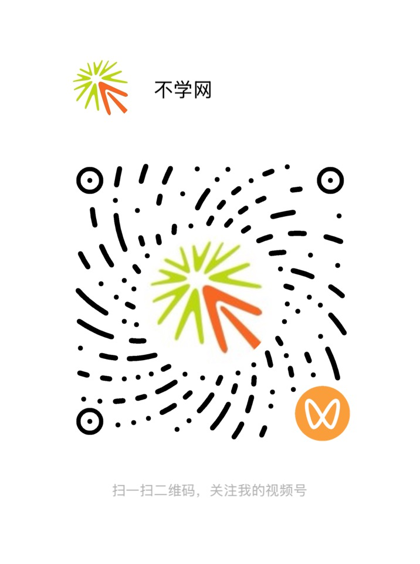

分享虚拟货币如何购买，以及基本的转账操作。讲解支付宝 微信 如何购买虚拟货币。

<!--more-->


- 在 [币安 Binance](https://www.binance.com) 用 **支付宝 / 微信** 购买虚拟货币（USDT）
- 虚拟货币的**基本转账**操作
- 本视频以苹果手机为例演示，其他手机操作也是类似的。



虚拟货币价格波动大，且存在政策与诈骗风险。请仅用于学习了解，务必核对收款地址、量力而行。


## YouTube 视频教程

直接看下面的视频即可，跟着操作就能搞定。

<iframe width="560" height="315" src="https://www.youtube.com/embed/kq8EL7rGogY?si=LRalN5AC5iVyMMCz" title="YouTube video player" frameborder="0" allow="accelerometer; autoplay; clipboard-write; encrypted-media; gyroscope; picture-in-picture; web-share" referrerpolicy="strict-origin-when-cross-origin" allowfullscreen></iframe>

## 国内视频


可以在微信 **视频号** 观看同款教程，扫下方二维码关注「不学网」即可。


