记录如何开一张国外信用卡，用于国外业务付款，支持国外常用业务，比如：绑定 App Store、绑定 Google Pay，以及给 ChatGPT、Gemini、Claude 充值。平时刷卡消费还能拿返现，官网写的是最高 3%。

<!--more-->


- 一个常用邮箱（用来注册 Ether.fi 账号）
- 一份海外身份资料，用于实名认证（KYC），下文有获取方式
- 一点 USDC（Base 链），用来给卡充值，下文有购买教程


## 打开网页

[打开注册地址](https://www.ether.fi/@017fcd2d)

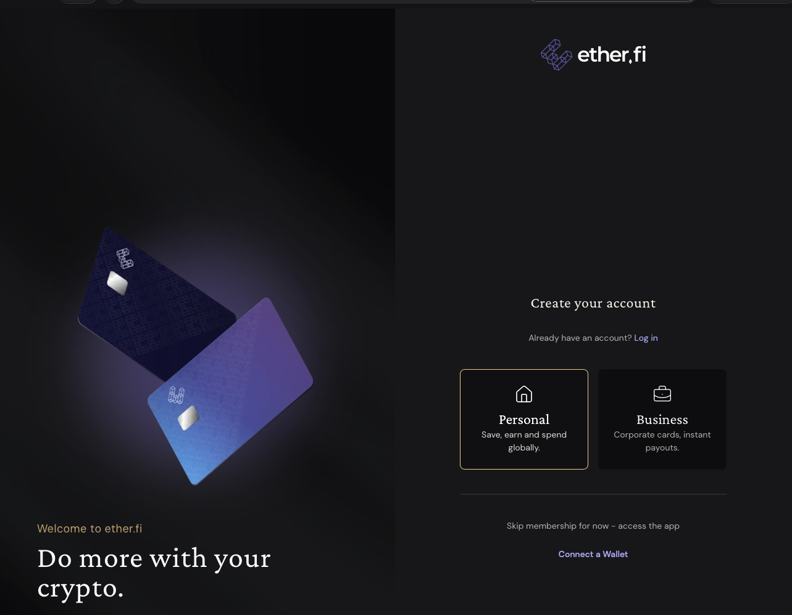

选择上图中的 Personal（个人）。

## 注册账号

### 输入你常用邮箱，点击 Continue 按钮

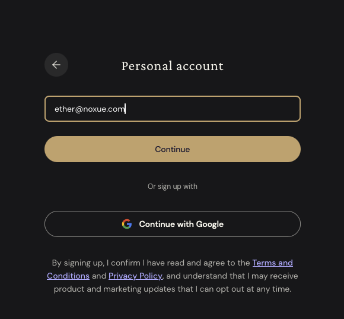

### 邮箱中查看收到的验证码，填写到下图

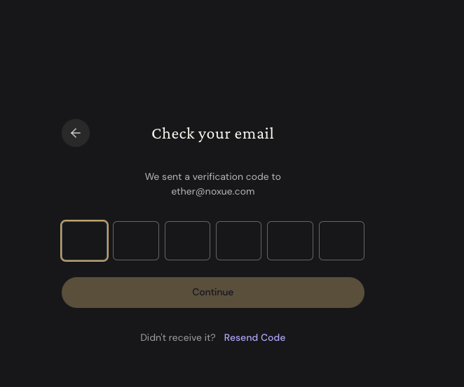

### 点击下图的 Accept & Continue 按钮

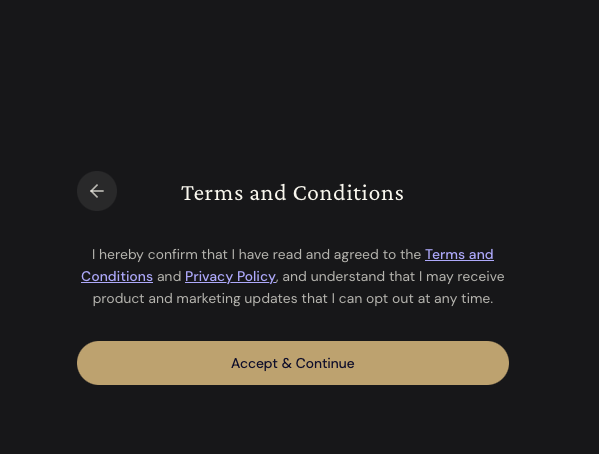

### 点击跳过 Skip for Now 按钮

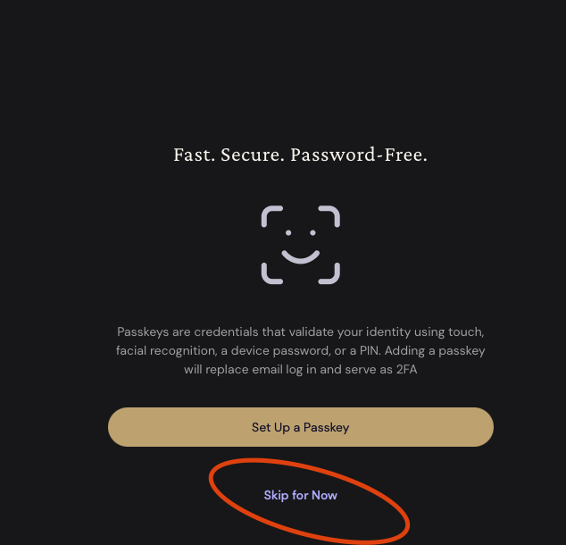

### 注册成功

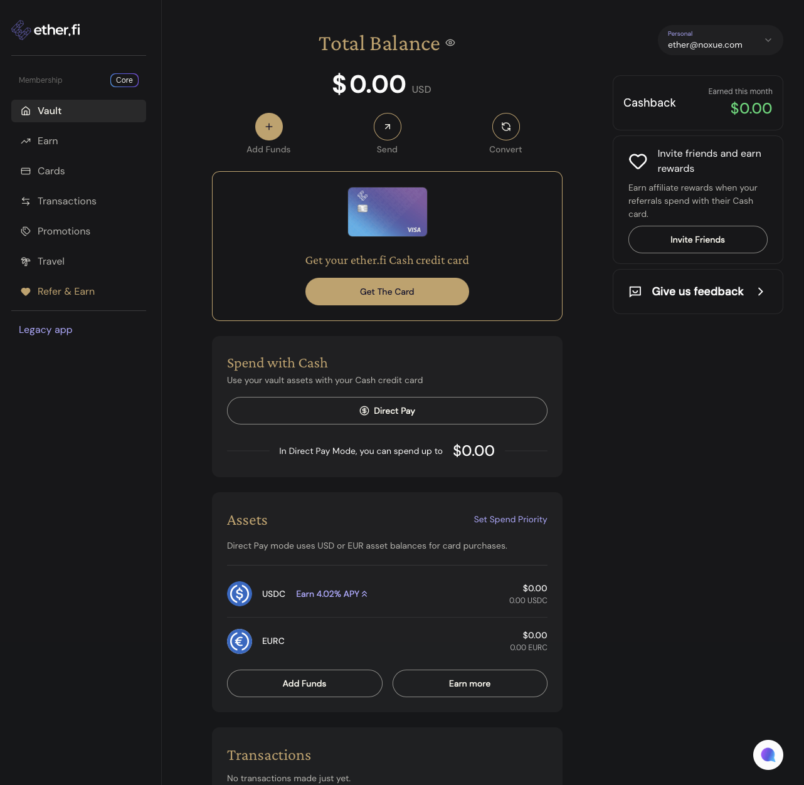

## 用海外身份实名认证（KYC）

实名也叫做 KYC（Know Your Customer），平台需要知道客户信息，因为开信用卡涉及到金融卡服务。

### 实名步骤

闲鱼搜索 **`ether`**，找商家帮你实名。一般 200 元以内可以搞定。


找商家要找那种给你自己注册的账号实名的，不要买那种他提供成品账号的，得用你上面注册的账号，账号完全属于你自己掌控。


## 充值虚拟货币到信用卡

### 添加资产
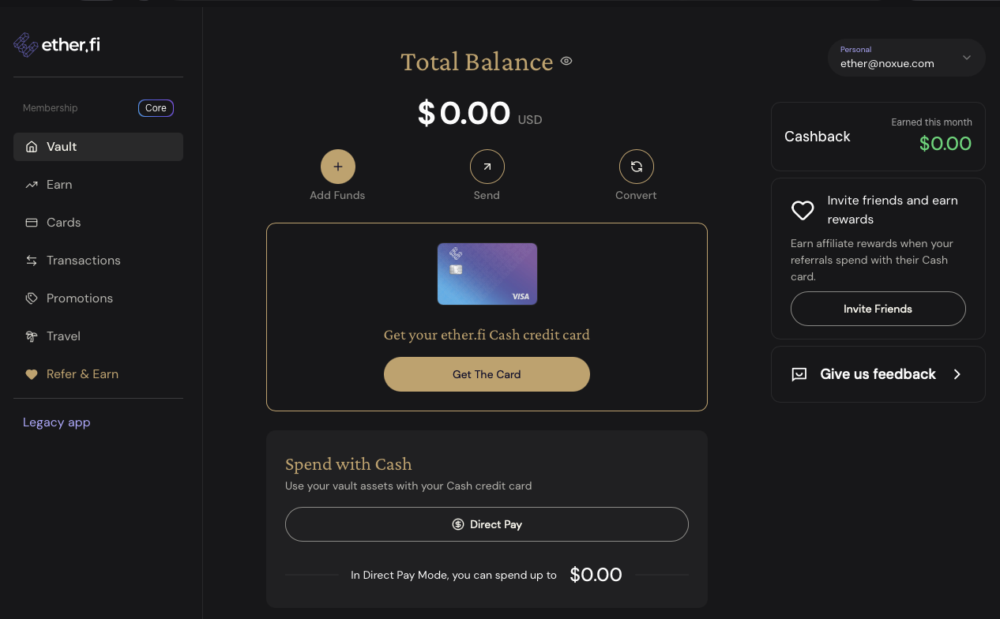

### 选择加密货币
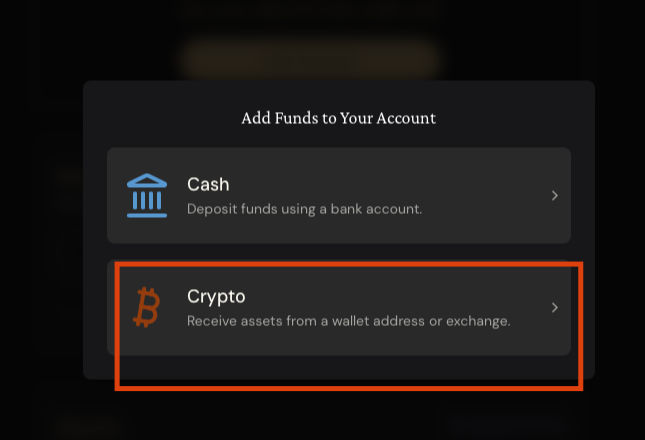

### 查看你的钱包地址
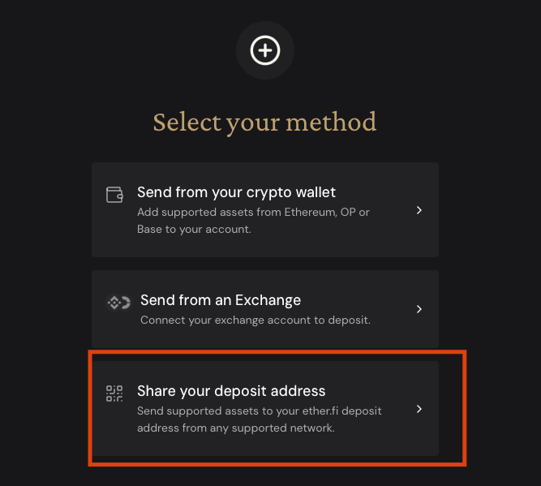

### 选择 USDC + Base 链
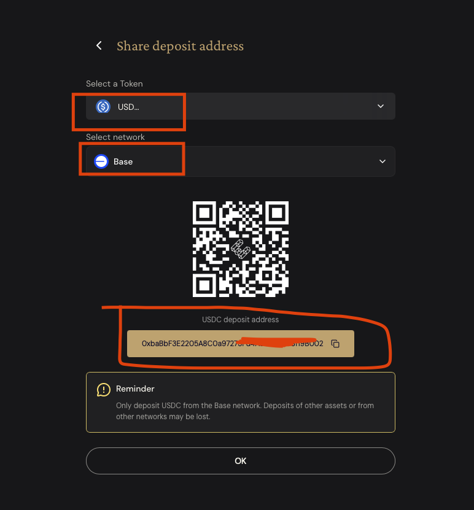

然后在你自己的钱包里，通过 Base 链把 USDC 转到上面这个地址，钱就会到你的 Ether.fi 账号里，接着开卡就可以用了。


选择 USDC 和 Base 链，转账时链选错资产可能无法找回。


购买虚拟货币以及充值 USDC 到 Ether.fi，可以看下面这个教程：



## 如何使用

实名、充值之后，在这里可以开 3 张卡。卡信息中有付款需要的卡号、姓名、地址、CVV。

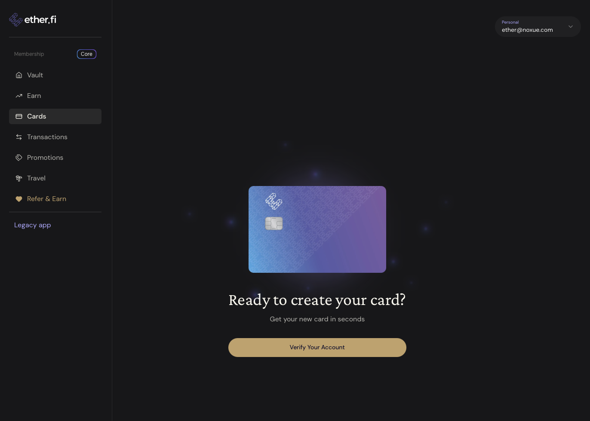


这些信息绝对不要给别人，特别是 CVV，它相当于你卡的密码，只要有这个，任何人都可以使用你的卡付款。


### 最好下载 APP 方便操作（可选。网页操作也是一样的）

下面是 app 中的效果，苹果的话直接 App Store 搜索 `etherfi` 下载登陆即可。

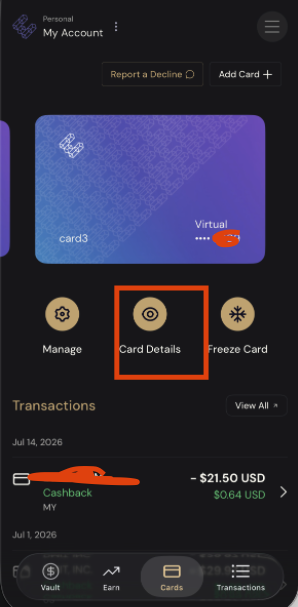

点击上图的 Card Details 就可以看到卡的具体信息，可以用于支付了，记得一定一定不能泄漏这些信息。

## 花钱之后有返现

这张卡消费是有返现的，官网写的是最高 **3%**。不同会员等级，每月能享受返现的消费额度上限不一样：

| 会员等级 | 解锁条件 | 每月返现额度 |
| --- | --- | --- |
| Core | 所有 Club 会员（免费就是这个等级） | 最高 $2,000/月 |
| Luxe | 累计 10K Membership Points | 最高 $10,000/月 |
| Pinnacle | 累计 50K Membership Points | 最高 $50,000/月 |
| VIP | 邀请制 | 官网未公布 |

也就是说，免费的 Core 等级每月有 $2,000 的消费享受返现，对于订阅 AI、买软件这类日常花销来说完全够用了。

另外两个费用也顺便记一下：

- ATM 取现手续费 **2%**
- 美元、欧元交易 **0 外汇手续费**（其他币种消费会有汇率差）


返现比例、每月额度、等级解锁条件平台都可能调整，最终以 [Ether.fi Cash 官网](https://www.ether.fi/cash) 上显示的为准。

