如何用自己的国外手机号，注册完全属于自己的谷歌账号，图文教程

<!--more-->

## 准备工作


1. 一个专属与自己的国外手机号，可收发短信（请看我博客 noxue.com 关于如何拥有自己的国外esim卡号的教程）
2. 稳定访问谷歌的网络环境


## 打开谷歌官网

在手机上操作也是大同小异，不是一定要电脑的

[www.google.com](https://www.google.com)

点击右上角注册按钮

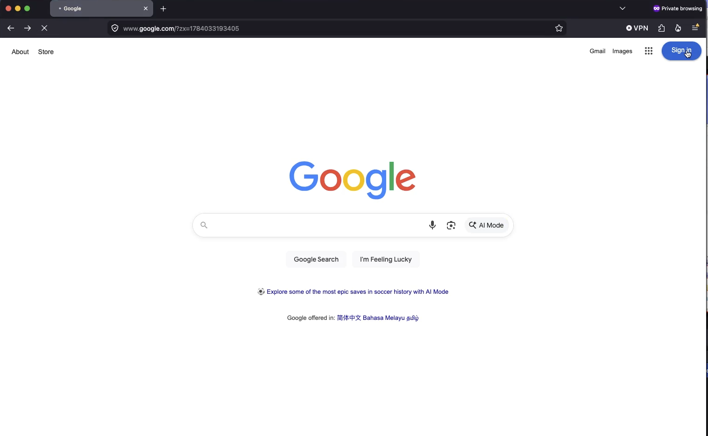

## 选择邮箱类型

点击 创建账号（create account），选个人用途

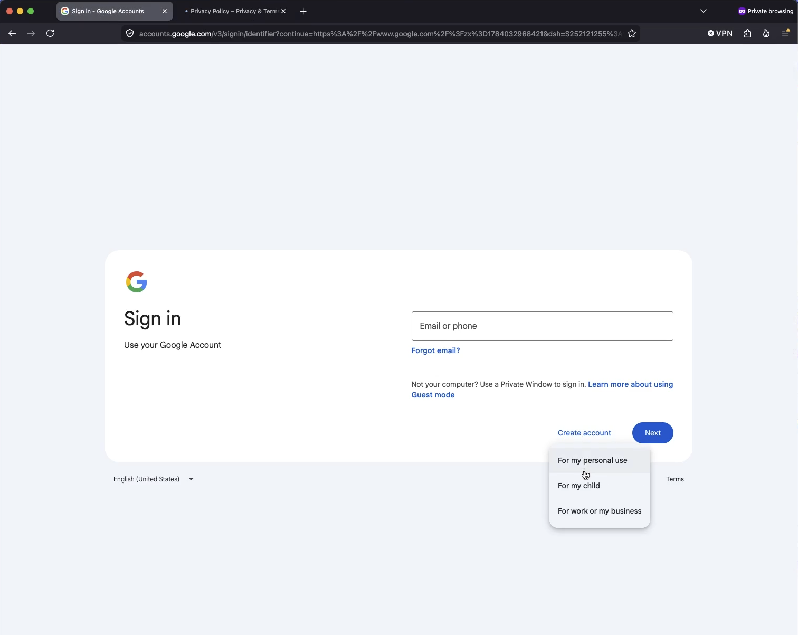

## 输入姓名

随意填写 无所谓

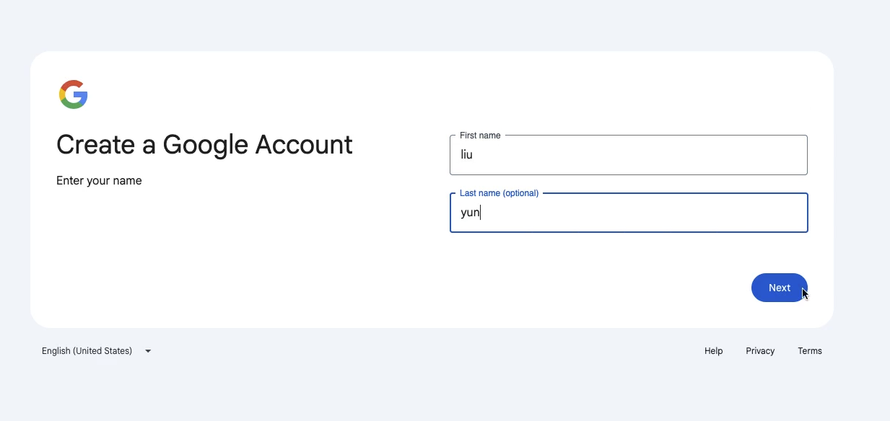

## 出生年月日

这个尽量填写一个超过18岁的生日（199x年就好了），性别随意（male男）（female女），好了就点 next


生日一定要填成年（199x 年即可），未成年账号会被限制无法正常注册。


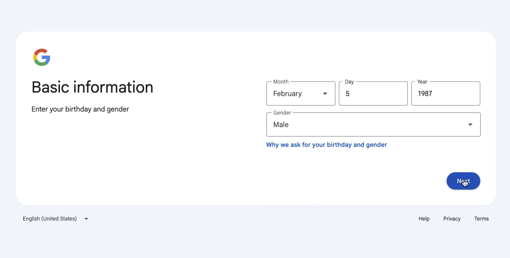

## 注册邮箱

这里要输入独一无二的名称，这就是你以后的邮箱地址，提示重复就换一个，好了就点 next

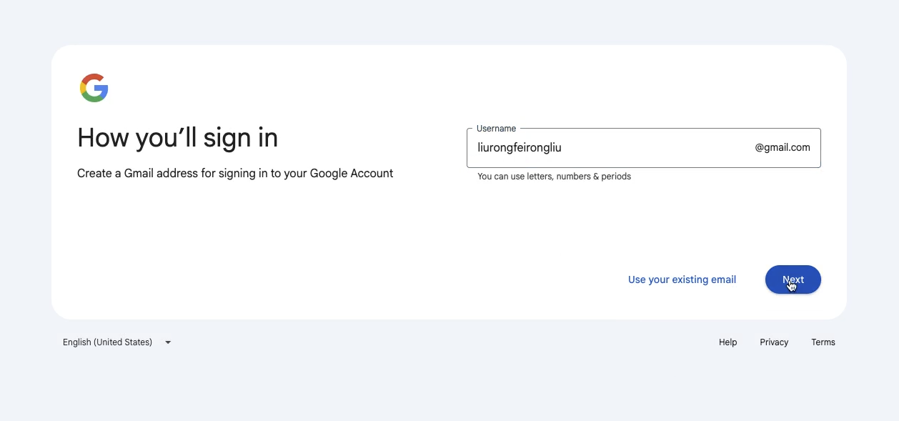

## 谷歌邮箱密码

尽量复杂一点， 好了点 next 按钮

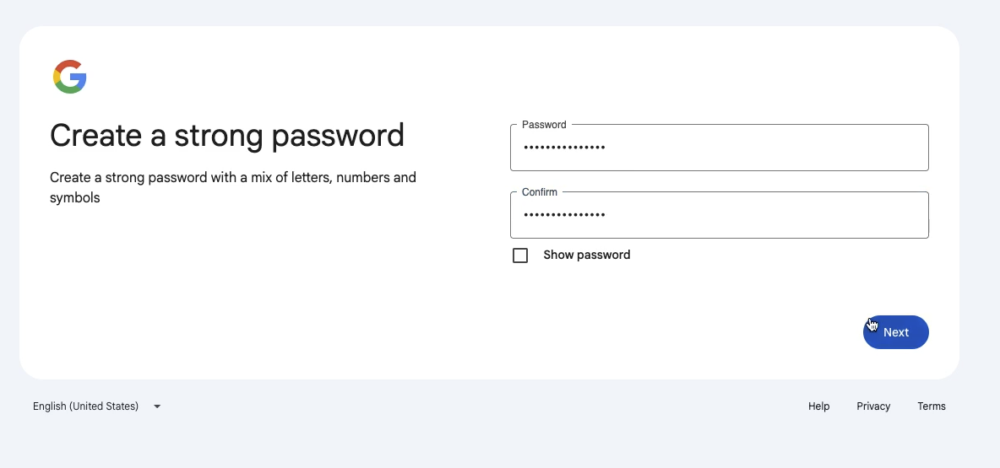

## 手机相机扫码

以苹果手机为例，打开手机相机，对着二维码 等一会儿会提示 浏览器打开，点一下就会浏览器打开

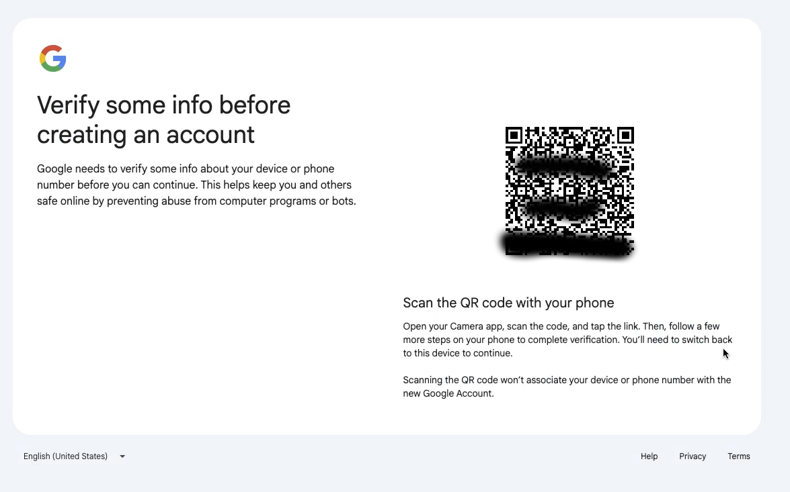

## 手机浏览器打开二维码网页

相机识别后会提示默认浏览器打开，打开后跳到下面的页面

点击 Send SMS（发送短信）

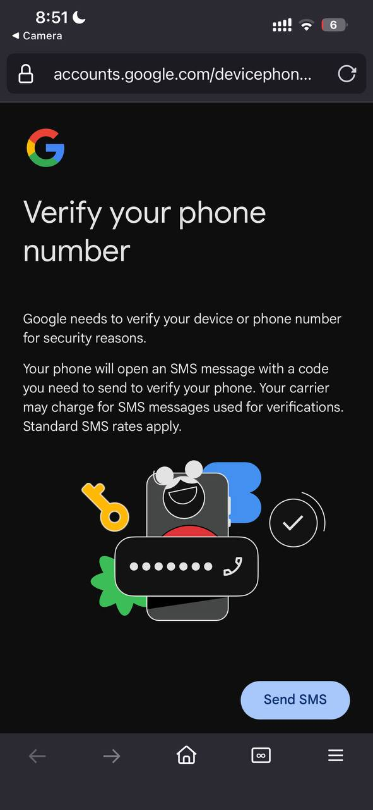

## 跳到发送短信界面


注意这个手机得是国外手机号（国内的目前已经注册不了），国外手机号如何搞，请查看我其他博客 [noxue.com](https://noxue.com)


跳到发送短信页面会直接填充好要发的内容，不要编辑，直接点发送

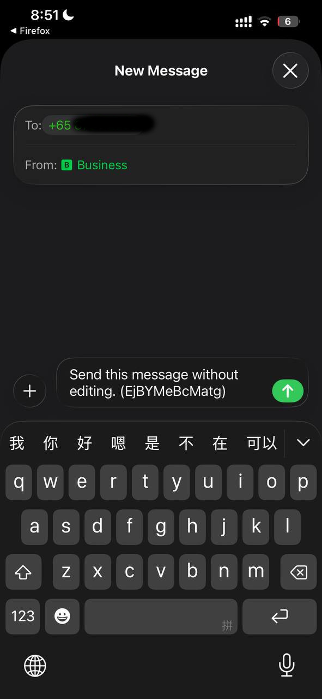

## 发送验证码

这样就是发送成功了，然后返回手机浏览器

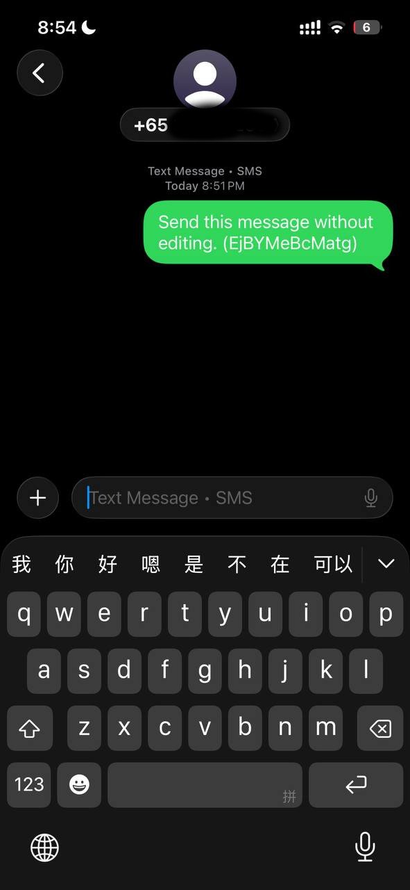

## 返回手机浏览器网页

提示查看电脑页面

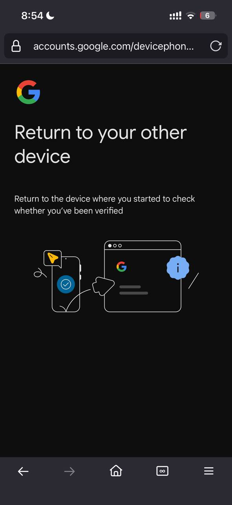

## 看电脑二维码页面

等待一会儿，正常的话就会进入加载状态，等待加载即可

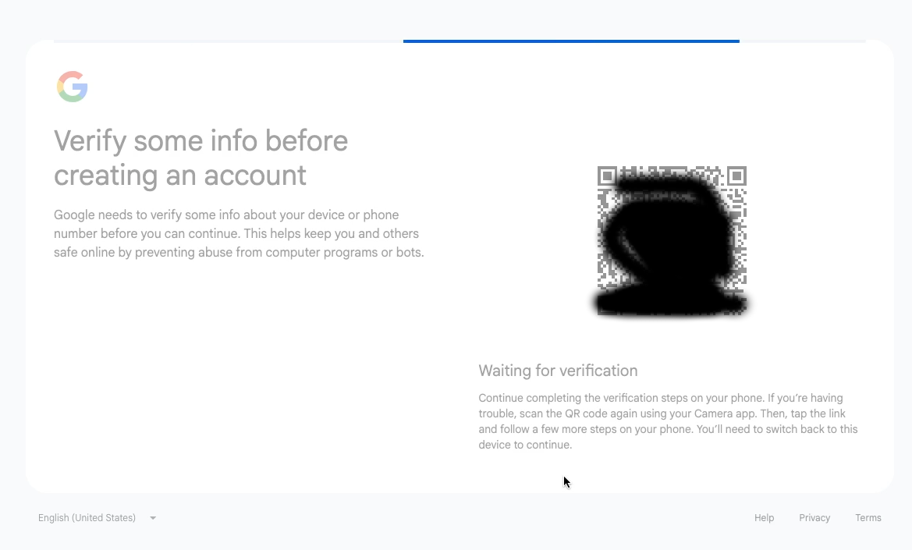

## 添加恢复邮箱

添加恢复邮箱，也就是今后忘记密码了，可以通过这个邮箱找回，建议填写常用邮箱，比如 qq，163等常用邮箱，然后点next


注意千万别填写错误，否则后续你丢失密码就找不回了


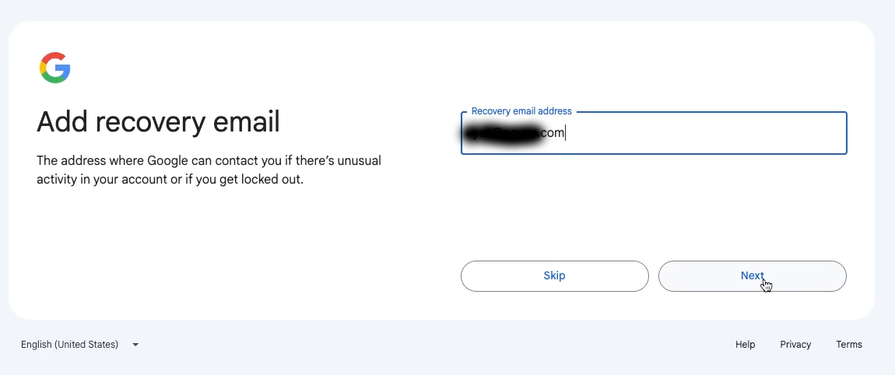

## 显示账号信息

显示谷歌邮箱信息

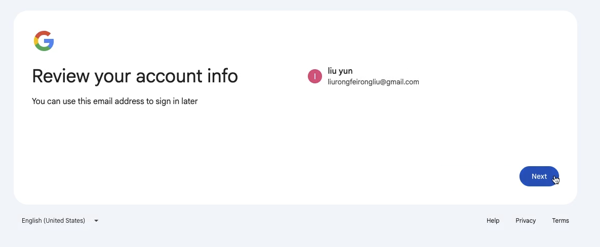

## 同意协议

鼠标滚动到底部 点 同意

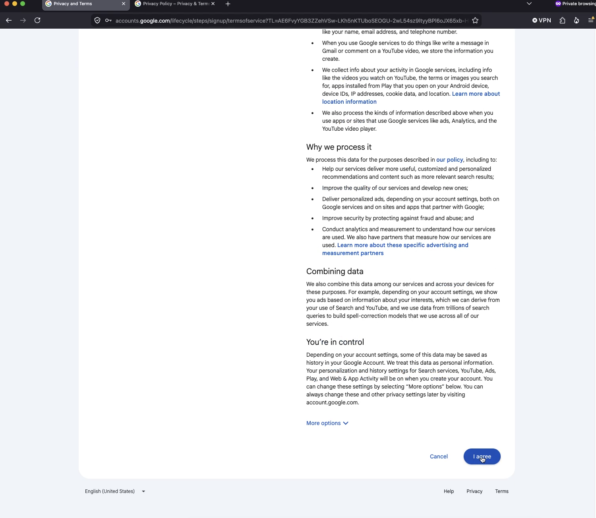

## 注册成功

会自动跳到谷歌首页，你点击右上角图标就会展示个人账号信息

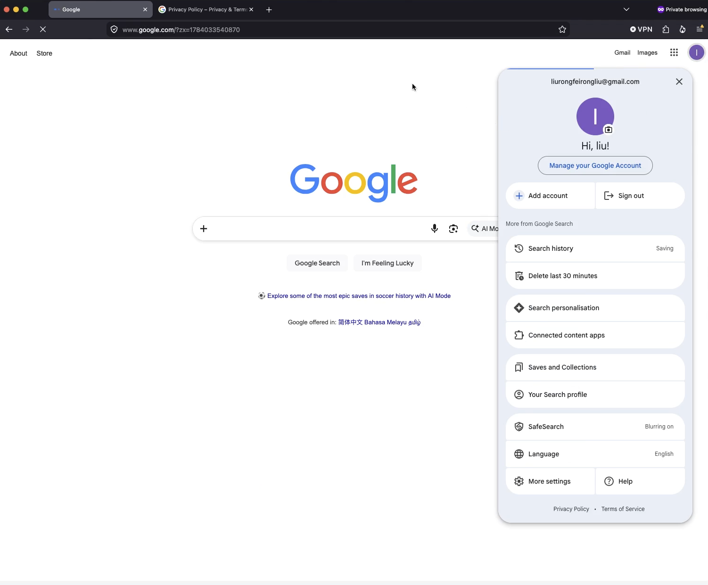

## 测试使用 Gemini


注意 使用 新加坡 美国 日本 等网络


[https://gemini.google.com/](https://gemini.google.com/)

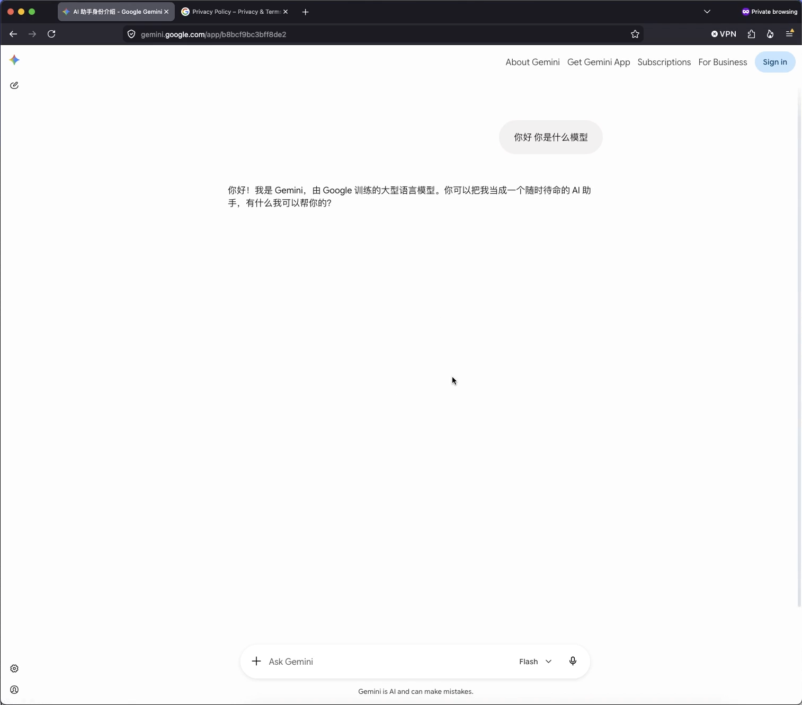

## 谷歌邮箱收发邮件

直接打开下面地址 就可以收发邮件，或者直接下载 gmail 这个 app

[gmail.com](https://gmail.com)
