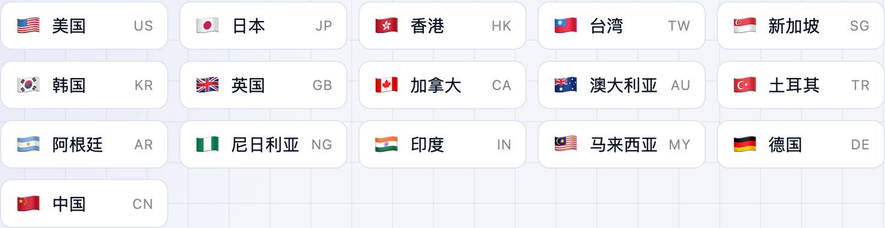
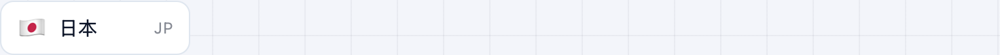

想下某个只在特定区上架的 App，得先把 App Store 切到那个国家/地区。**不学网工具箱** 的 [App Store 换区跳转工具](https://tools.noxue.com/appstore-region/) 点一下就唤起 App Store 切过去，不用一层层翻设置。

<!--more-->

## 特点

- **常用地区直点**：美区、日区、港区等常用地区放最上面，点一下就跳。
- **全球搜索**：177 个国家和地区，支持中文名、英文名、两位国家代码搜索。
- **账户相关直达**：App Store 账户页、订阅管理、付款信息一键打开。

## 第一步：点一个地区

在「常用地区」里直接点目标地区，会唤起 App Store 切过去。


切换链接只能在 iPhone / iPad / Mac 的 Safari 里点击才能唤起 App Store。用微信等 App 内置浏览器打开时，工具会提示你复制链接到 Safari。


## 第二步：搜不常用的地区

常用列表里没有？在「全部地区」搜索框里输入国家名或代码，比如「日本」「us」「Japan」。

工具地址：**[https://tools.noxue.com/appstore-region/](https://tools.noxue.com/appstore-region/)**
