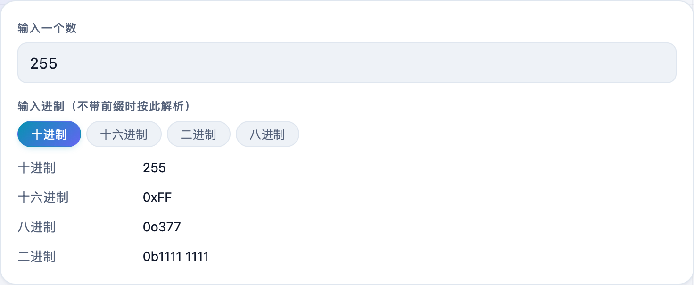
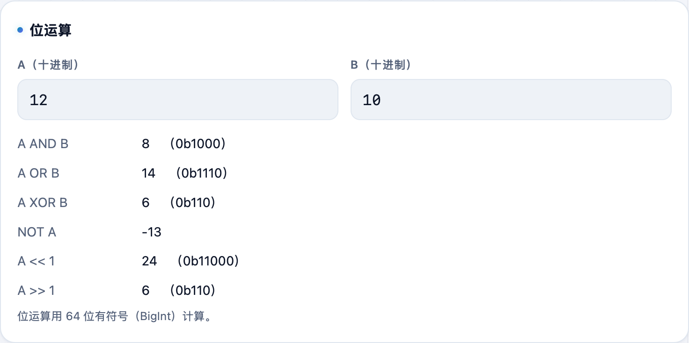

调寄存器、看权限位、算颜色值时，二进制、十六进制、十进制来回换很常见。**不学网工具箱** 的 [进制转换](https://tools.noxue.com/base/) 一次把四种进制都列出来，还带位运算和 ASCII 查询。

<!--more-->

## 能做什么

- **四进制互转**：输入一个数，二/八/十/十六进制同时给出。
- **认前缀**：支持 `0x1F`、`0b1010`、`0o17` 前缀，不带前缀时按你选的进制解析。
- **位运算**：填 A、B 两个数，AND / OR / XOR / 移位等结果一起出（按 64 位有符号 BigInt 计算）。
- **ASCII / 字符**：输入一个字符看它的编码，或反查。

## 第一步：输入一个数

填一个数（比如 `255` 或带前缀的 `0xFF`），下面立刻给出四种进制的结果。

## 第二步：位运算

在「位运算」里填 A、B 两个十进制数，AND / OR / XOR / 移位等结果一并列出。


`0x` 十六进制、`0b` 二进制、`0o` 八进制。带了前缀就按前缀解析，不带就按你选的输入进制。


工具地址：**[https://tools.noxue.com/base/](https://tools.noxue.com/base/)**
