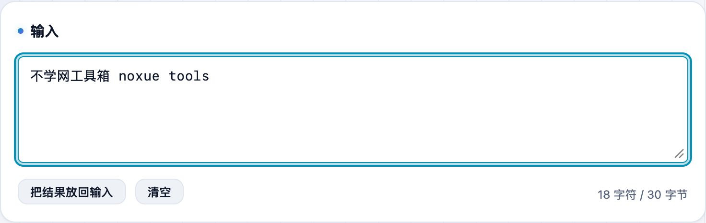
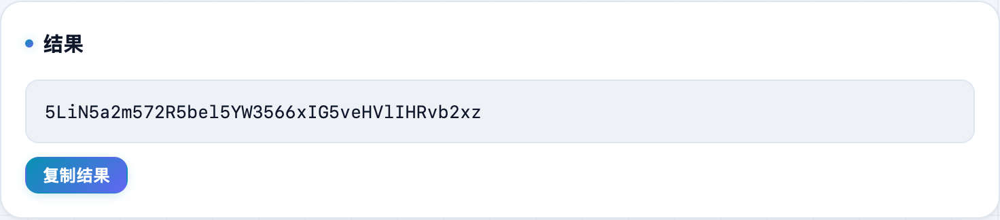

要把一段文字、一小段数据转成 Base64，或者反过来解开？很多在线工具一遇到中文就乱码。**不学网工具箱** 的 [Base64 编解码](https://tools.noxue.com/base64/) 先按 UTF-8 取字节再编码，中文、Emoji 都能正确往返，还支持 URL 安全变体。

<!--more-->

## 特点

- **中文不乱码**：按 UTF-8 处理，中文、Emoji 正确往返。
- **两种变体**：标准 Base64，以及把 `+ /` 换成 `- _`、去掉尾部 `=` 的 **URL 安全**版本（用在网址和 JWT 里）。
- **双向**：编码、解码一键切换。
- **纯本地**：在浏览器里算，内容不上传。

## 第一步：粘内容，选变体和方向

把内容粘进输入框，选「标准 Base64」还是「Base64 URL 安全」，再选编码 / 解码。


Base64 只是一种表示方式，任何人都能解回原文，别拿它保护敏感数据。


## 第二步：拿结果，一键复制

下面实时出结果，点「复制结果」即可。下图把「不学网工具箱 noxue tools」编成了 Base64。

配套：解 JWT 的前两段用 [JWT 解码](https://tools.noxue.com/jwt/)；算哈希用 [MD5 / SHA 哈希](https://tools.noxue.com/hash/)。

工具地址：**[https://tools.noxue.com/base64/](https://tools.noxue.com/base64/)**
