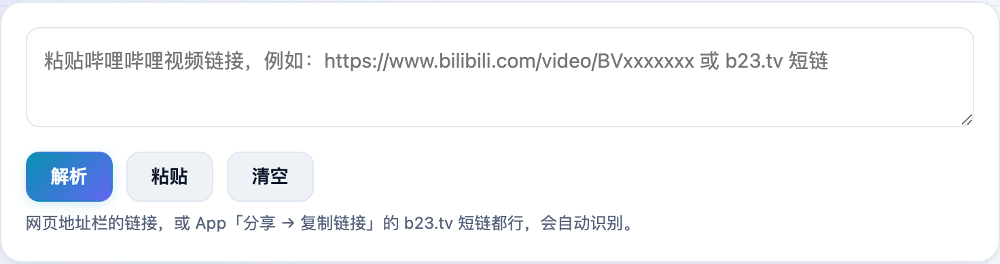
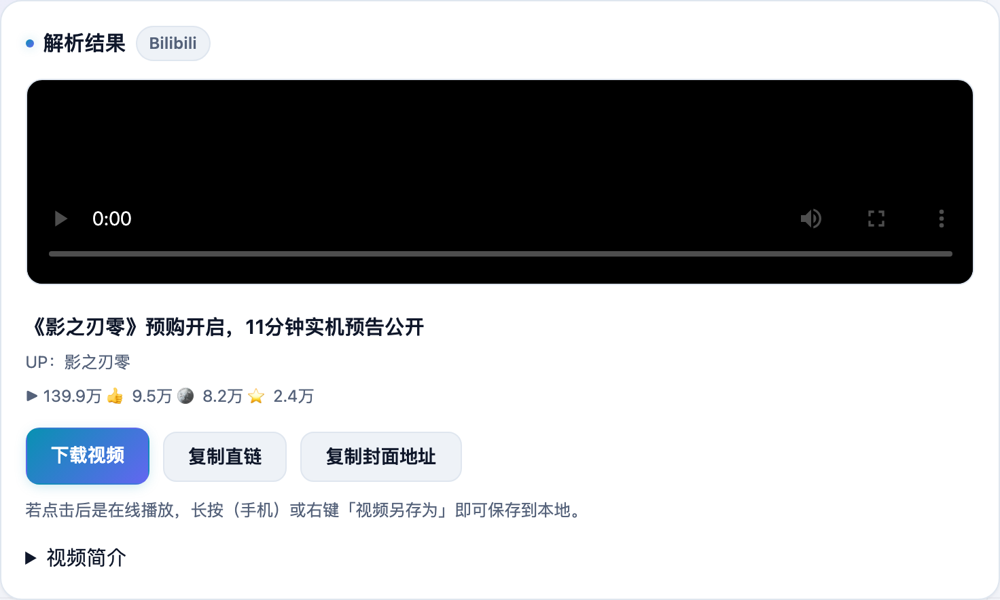

想把 B 站的视频存下来，装插件、开客户端都嫌麻烦。**不学网工具箱** 的 [B站视频解析](https://tools.noxue.com/bilibili/) 把链接一粘就行——在线预览、直接下载，还顺带显示 UP 主和播放数据，全程不用登录。

<!--more-->

## 特点

- **粘贴即用**：网页链接或 App 分享的 `b23.tv` 短链都能自动识别。
- **无水印直链**：免登录拿到整合好的 MP4，可在线播放，也能下载保存。
- **信息齐全**：标题、UP 主、封面、简介，加上播放 / 点赞 / 投币 / 收藏数据一目了然。

## 第一步：粘贴 B 站链接

把视频链接粘进输入框，点「解析」。手机上可以直接点「粘贴」读剪贴板。

## 第二步：预览、下载、看数据

稍等一两秒，视频就出现在页面里，可以直接播放。下面有「下载视频」「复制直链」按钮，还列出了这条视频的播放数据。


免登录能拿到的是整合好的 MP4（一般 360P/480P），适合快速留存；更高清晰度需要登录账号，本工具不做登录，也不保存你的任何信息。



解析出的视频版权归原 UP 主所有，请仅用于个人学习备份，不要用于商业或侵权传播。


工具地址：**[https://tools.noxue.com/bilibili/](https://tools.noxue.com/bilibili/)**
