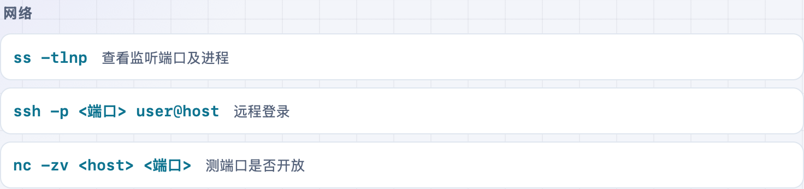

「解压 tar 是哪几个参数来着」「查端口占用怎么写」——常用命令老记不全。**不学网工具箱** 的 [常用命令速查](https://tools.noxue.com/cmd/) 按系统分好，用途也能搜，点一下就复制。

<!--more-->

## 特点

- **三系统**：Linux、Windows、macOS 一键切换。
- **按用途搜**：不光能搜命令名，还能搜「解压」「端口」「进程」「ip」这类用途。
- **复制即用**：找到就点一下复制，不用手敲。

## 第一步：选系统，搜一下

顶部选 Linux / Windows / macOS，在搜索框输命令或用途关键词。

## 第二步：找到命令，点一下复制

搜「端口」就列出查端口相关的命令和说明，点一下即复制。


命令名和用途都能搜，比如查进程可以搜「进程」也可以搜 `ps`；不确定就用中文用途词试试。


工具地址：**[https://tools.noxue.com/cmd/](https://tools.noxue.com/cmd/)** ，纯前端，打开即用。
