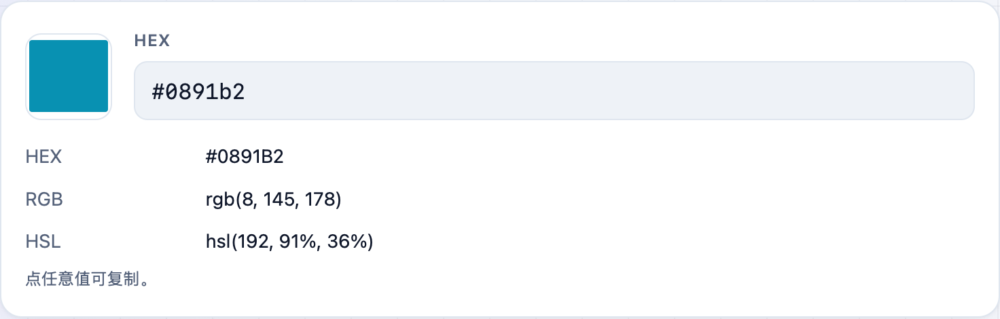
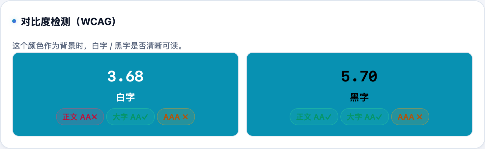

做前端、写样式时经常要在 HEX、RGB、HSL 之间来回换，还得确认文字在背景上够不够清楚。**不学网工具箱** 的 [颜色工具](https://tools.noxue.com/color/) 一个页面把这些都办了。

<!--more-->

## 能做什么

- **格式互转**：取一个颜色，HEX / RGB / HSL 等各种写法同时给出，点任意值即复制。
- **明暗色阶**：自动生成这个色的一排深浅变体，配色、做 hover 态很方便。
- **对比度检测（WCAG）**：这个色当背景时，白字/黑字够不够清晰，直接给出对比度和 AA/AAA 判定。

## 第一步：取色，看各种格式

用取色器或直接填 HEX，下面就列出对应的 RGB、HSL 等格式，点任意一个即复制。

## 第二步：查对比度，配色不翻车

往下是**对比度检测**：这个色作为背景时，白字和黑字各自的对比度，以及是否达到 WCAG 的 AA / AAA。


正文对比度尽量 ≥ 4.5（AA），大字 ≥ 3；追求更高可达 ≥ 7（AAA）。


工具地址：**[https://tools.noxue.com/color/](https://tools.noxue.com/color/)**
