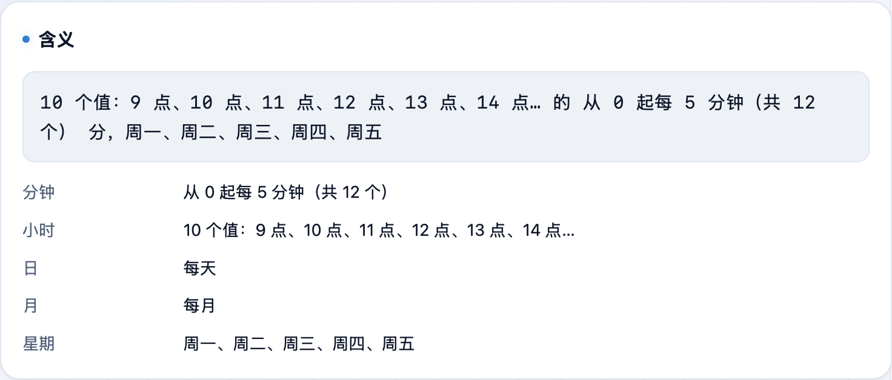

写 crontab、配定时任务时，`*/5 9-18 * * 1-5` 这种表达式到底啥时候跑，光看容易懵。**不学网工具箱** 的 [Cron 表达式解释](https://tools.noxue.com/cron/) 直接翻译成中文，还把接下来几次执行时间给你算好。

<!--more-->

## 能做什么

- **中文解释**：把 5 段表达式翻译成「从 0 起每 5 分钟…周一到周五」这样的人话。
- **逐字段拆解**：分、时、日、月、周每一段分别说明。
- **下次执行时间**：按你本机时区，算出接下来几次会在什么时候跑。
- **常用预设**：每分钟、每小时、每天等常见表达式一点即用。

## 第一步：输入 Cron 表达式

在输入框写 5 段（分 时 日 月 周），或点下面的常用预设。

## 第二步：看中文含义和执行时间

下面立刻给出**中文含义**和每个字段的拆解，再往下是**接下来的执行时间**。


顺序是「分 时 日 月 周」，例如 `0 3 * * *` 表示每天凌晨 3 点。工具会帮你逐段翻译，不用死记。


工具地址：**[https://tools.noxue.com/cron/](https://tools.noxue.com/cron/)** ，纯前端，打开即用。
