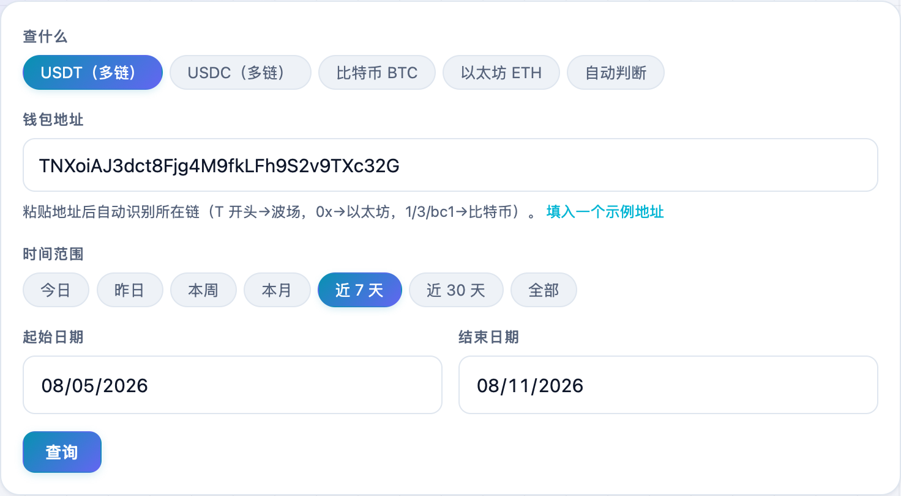
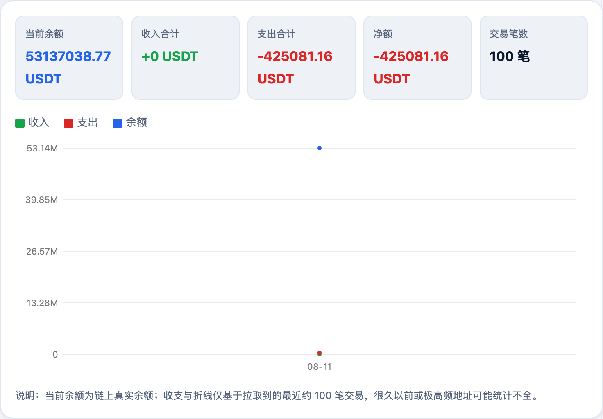
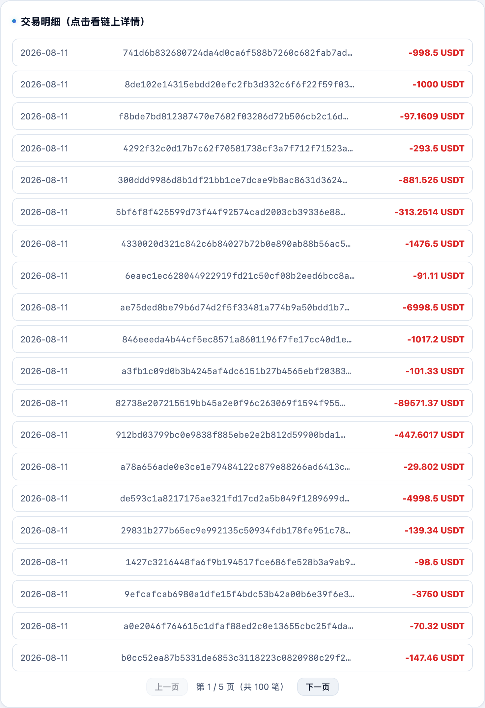

想快速看一个钱包地址「进了多少、出了多少、现在还剩多少」，又不想在一堆区块链浏览器里翻来翻去？我在 **不学网工具箱** 里做了个 [虚拟货币地址交易查询](https://tools.noxue.com/crypto/)：粘贴地址、点一下，余额、收支、折线图全出来。

<!--more-->

## 它能做什么

- **自动识别链**：`T` 开头当波场，`0x` 开头当以太坊，`1/3/bc1` 开头当比特币，不用你手动选。
- **多链稳定币**：USDT、USDC 都支持波场（TRC20）和以太坊（ERC20）两条链。
- **当前真实余额**：直接读链上余额，不是估算。
- **收支统计 + 折线图**：按你选的时间范围，把收入、支出、余额变化画成三条线。
- **纯查询、只读地址**：数据来自公共区块链浏览器，不涉及任何私钥，也不用登录。


打开 [tools.noxue.com/crypto](https://tools.noxue.com/crypto/)，点页面里的「填入一个示例地址」就能先试一把。


## 第一步：选币种、填地址、定时间范围

顶部先选「查什么」——默认是 USDT，也可以选 USDC、比特币、以太坊，或者干脆用「自动判断」。然后把钱包地址粘进去，选一个时间范围（今日 / 本周 / 近 30 天 / 全部……）。


选「自动判断」，直接把地址粘进去就行，工具会根据地址开头自动认出所在链。


## 第二步：点「查询」，看余额和收支折线

点一下「查询」，稍等一两秒，上面出来五张卡片：**当前余额、收入合计、支出合计、净额、交易笔数**；下面是折线图——绿线是收入、红线是支出、蓝线是余额随时间的变化，鼠标移上去还能看每天的明细。


顶部「当前余额」是链上真实余额；收支和折线是基于拉取到的最近约 100~200 笔交易再按日期过滤的，很久以前或极高频的地址可能统计不全。


## 第三步：翻交易明细，点开看链上详情

再往下是**交易明细**列表，每笔标了日期、哈希和金额（收入绿、支出红），支持分页。点任意一条，会跳到对应链的区块链浏览器看完整详情。

## 一些实用场景

- 收 U 之前，先查一下对方地址的历史，心里有个底；
- 给自己的地址做个简单的「进出账」统计；
- 看某个热钱包 / 项目地址最近的资金进出。


这个工具只读公开的链上数据，永远不会问你要私钥或助记词。任何要你输入私钥/助记词的「查询工具」都要高度警惕。


工具地址：**[https://tools.noxue.com/crypto/](https://tools.noxue.com/crypto/)** ，界面支持中英日韩等多种语言，右上角可切换。用着有什么想法，欢迎去[意见箱](https://tools.noxue.com/feedback/)告诉我。
