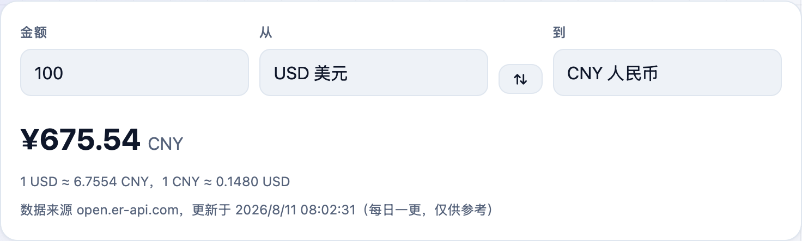
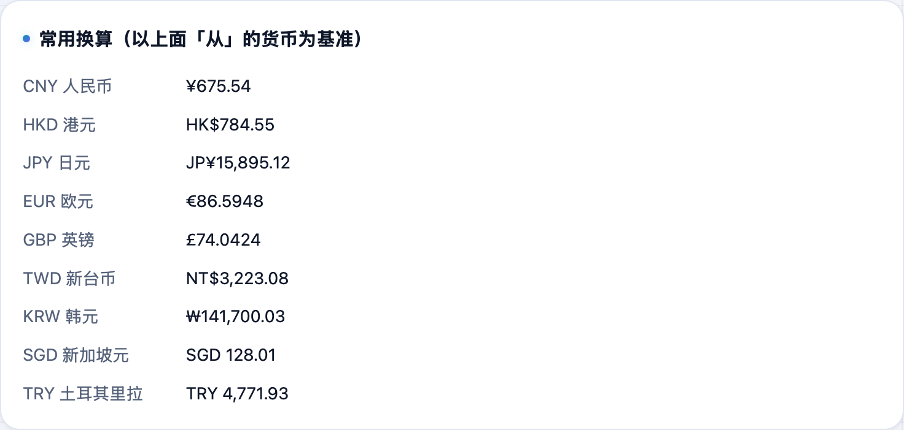

海淘比价、看外汇、算旅费时想快速换个汇率？**不学网工具箱** 的 [汇率换算](https://tools.noxue.com/currency/) 支持 160 多种货币互转，还给一张常用货币对照表。

<!--more-->

## 特点

- **160+ 货币**：主流货币基本都有，从「从 / 到」两个下拉里选。
- **一键互换**：点中间的 ⇅ 直接调换方向。
- **常用对照表**：以你选的基准货币，一次列出兑常用货币的汇率，扫一眼就有数。

## 第一步：填金额，选货币

输入金额，选「从」哪种货币换到「到」哪种货币，结果立刻出来。

## 第二步：看常用货币对照

下面的对照表以你选的「从」货币为基准，列出兑一批常用货币的金额，比价省事。


汇率数据用于日常估算，实际成交以银行 / 交易平台为准。


工具地址：**[https://tools.noxue.com/currency/](https://tools.noxue.com/currency/)**
