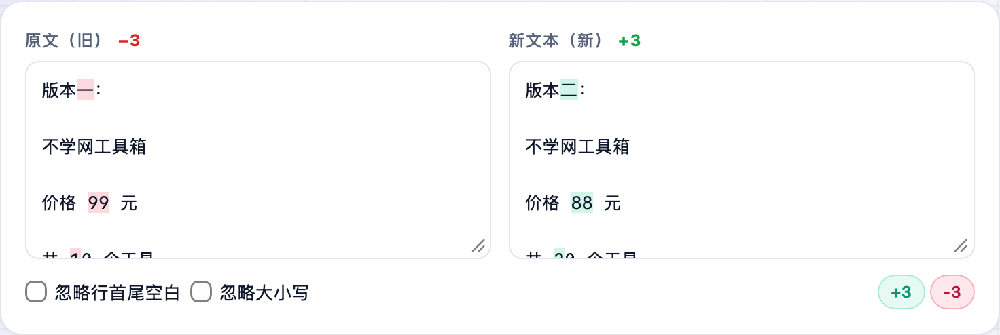
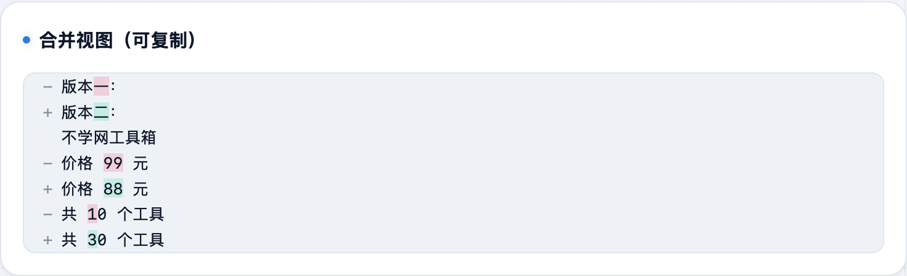

两段文本、两版配置、两次输出，想快速看出改了哪里？**不学网工具箱** 的 [文本对比 Diff](https://tools.noxue.com/diff/) 把差异**直接在两个编辑框里高亮**出来，连一行内改了哪几个字都精确标出，还能边看边改。

<!--more-->

## 特点

- **就地高亮**：不用切到第三个面板，差异直接标在你粘贴的两个框里。
- **逐字符对比**：不只是整行标红，连一行内变了哪几个字符都单独高亮。
- **忽略选项**：可忽略行首尾空白、忽略大小写，排掉无关噪声。
- **合并视图**：下面给一份合并后的差异，可直接复制。

## 第一步：左右各粘一段文本

左边放**原文（旧）**，右边放**新文本（新）**。工具立刻标出增删：左侧红色是删掉的，右侧绿色是新增的，右上角还统计了 `+N / -N`。


改了个配置文件不确定动了哪儿？两版一贴，一行内的细微改动都能精确定位。噪声多就勾上「忽略行首尾空白」。


## 第二步：看合并视图，复制结果

下面的**合并视图**把两段的差异整合成一份，需要贴到别处时直接复制。

工具地址：**[https://tools.noxue.com/diff/](https://tools.noxue.com/diff/)** ，纯前端，文本不上传。
