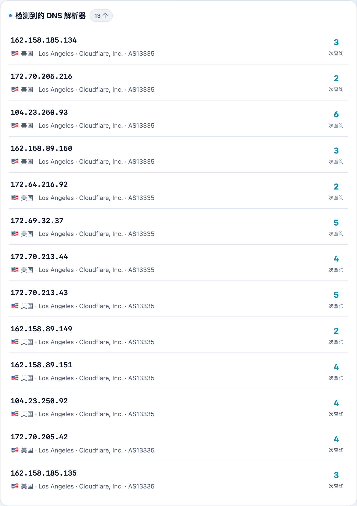

以为挂了代理就万事大吉，其实 DNS 请求可能偷偷绕过代理、走了本地运营商——这就是 DNS 泄漏，会暴露你真实的上网地区。**不学网工具箱** 的 [DNS 泄漏检测](https://tools.noxue.com/dnsleak/) 帮你查清楚。

<!--more-->

## 原理

向一批唯一子域名发请求，我们自建的**权威 DNS 服务器**会记录「是哪个 DNS 解析器来查询的」。如果这些解析器的国家/运营商和你的出口 IP 对不上，就说明 DNS 绕过了代理（泄漏）。检测数据几分钟后自动从服务器内存清除。

## 第一步：打开就持续探测

页面一打开就不停发起 DNS 探测，中间大大的数字是**已发起的探测次数**，让你知道它在工作。

## 第二步：看检测到的解析器和结论

下面列出**检测到的 DNS 解析器**及各自的归属地，顶部给出结论：如果有解析器和你出口 IP 不在同一国家，就提示「疑似泄漏」。


用代理的 TUN / 全局模式让它接管整个网卡的 DNS；或在代理软件里指定加密 DNS（DoH/DoT），别用运营商默认 DNS。


工具地址：**[https://tools.noxue.com/dnsleak/](https://tools.noxue.com/dnsleak/)**
