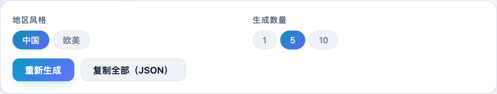
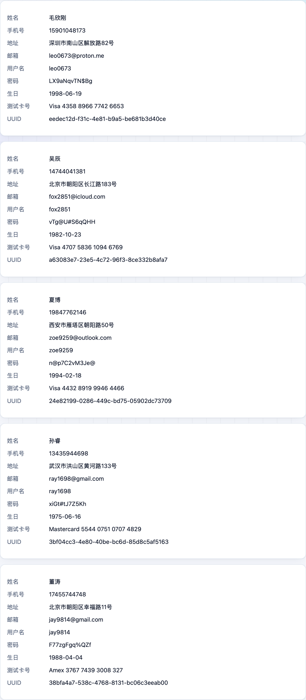

填测试表单、造演示数据时，一个个瞎编姓名邮箱太累。**不学网工具箱** 的 [假数据生成](https://tools.noxue.com/faker/) 一键随机造一批，中国 / 欧美风格可选，还能直接复制成 JSON。

<!--more-->

## 特点

- **一批常用字段**：姓名、邮箱、手机号、地址、银行卡号等一次性给全。
- **地区风格**：中国风格或欧美风格，名字、地址更像样。
- **批量**：一次生成 1 / 5 / 10 条。
- **复制 JSON**：直接复制成 JSON，塞进测试代码或接口就能用。

## 第一步：选风格和数量

选「中国 / 欧美」风格和生成数量，点「重新生成」。

## 第二步：拿数据，复制 JSON

下面列出生成的一批假数据，需要时点「复制全部（JSON）」拿走。


这里生成的都是随机假数据，卡号符合 Luhn 校验但不对应任何真实账户、无法消费。请勿用于任何欺诈用途。


工具地址：**[https://tools.noxue.com/faker/](https://tools.noxue.com/faker/)** ，纯前端，打开即用。
