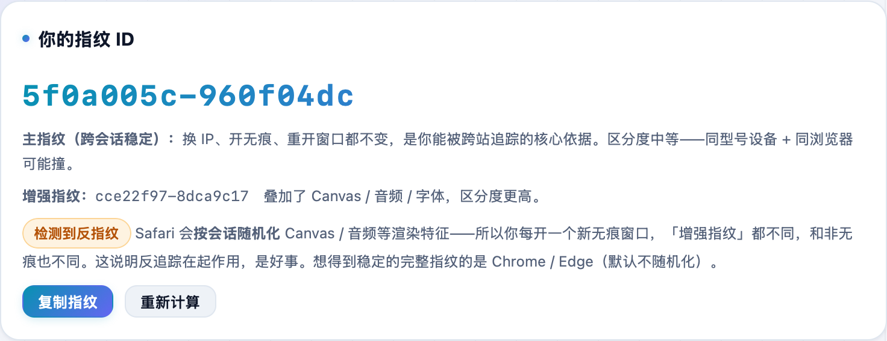
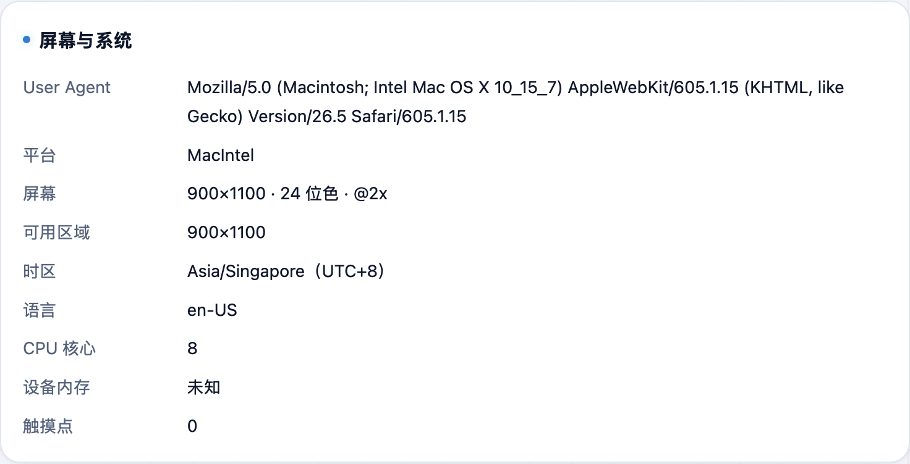

换代理、开无痕，网站却还是能认出你——因为它靠的不是 IP，而是**浏览器指纹**。**不学网工具箱** 的 [浏览器指纹检测](https://tools.noxue.com/fingerprint/) 把这些特征算出来给你看，全程本地、不上传。

<!--more-->

## 能看到什么

- **唯一指纹 ID**：由下面所有特征算出的一串值，同一设备同一浏览器，换 IP / 开无痕后几乎不变。
- **Canvas / WebGL / 音频**：渲染类特征，最能区分设备。
- **屏幕与系统**：分辨率、色深、时区、语言、CPU 核心、内存等。
- **字体与能力**：装了哪些字体、支持哪些特性。

## 第一步：看你的指纹 ID

页面一打开就算出你的**指纹 ID**。刷新、换 IP、开无痕再回来，你会发现它基本没变——这正是网站追踪你的原理。

## 第二步：看各项特征

往下按 Canvas/WebGL/音频、屏幕与系统、字体与能力分组，列出每一项具体值——这些加起来就构成了你的「数字长相」。


真正防追踪要靠指纹浏览器（AdsPower、Multilogin 等）或反指纹扩展；用主流设备 + 主流浏览器默认配置，混在人群里反而更安全。


工具地址：**[https://tools.noxue.com/fingerprint/](https://tools.noxue.com/fingerprint/)**
