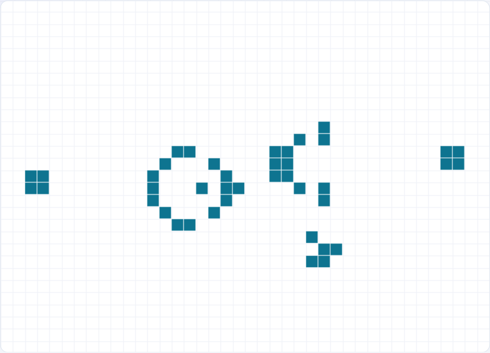
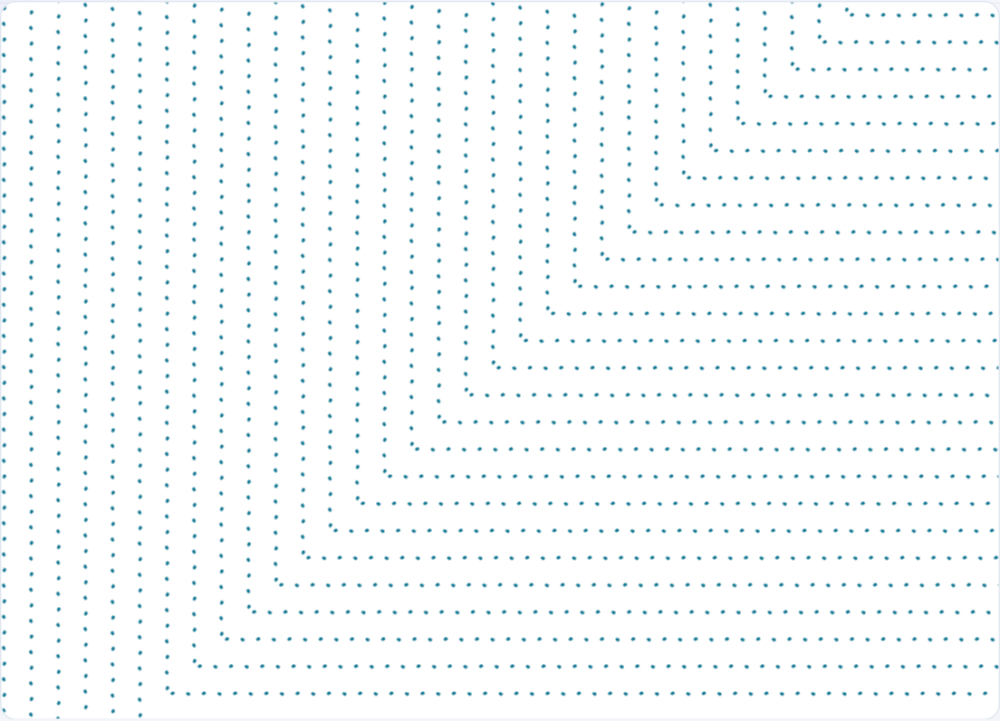

只用「活细胞邻居 2~3 个存活、死细胞正好 3 个邻居复活」这么一条规则，就能演化出滑翔机、飞船、脉冲星，甚至能算数、能自我复制。**不学网工具箱** 的 [康威生命游戏](https://tools.noxue.com/game-of-life/) 让你在无限大的地图上随手玩。

<!--more-->

## 特点

- **无限地图**：地图无限大，随手拖动平移、滚轮缩放，想看多远看多远。
- **绘制 + 预制**：切到「绘制」模式自己画细胞，或从预制里一键放滑翔机、高斯帕枪、脉冲星等经典图案，还能「导入 RLE」加载 [LifeWiki](https://conwaylife.com/wiki/) 上的任意图案。
- **全屏沉浸**：点「全屏」让画面布满整个网页，看图案演化更过瘾。
- **生命游戏里的生命游戏**：内置 OTCA 元胞机——一个本身由生命游戏构成的「细胞」。

## 玩法一：放个高斯帕滑翔机枪

在预制里选「高斯帕滑翔机枪」，点播放——它会源源不断地吐出滑翔机，是第一个被发现的「无限增长」图案。

## 玩法二：生命游戏里的生命游戏

预制里选「🔬 元胞机 OTCA metapixel」，会加载一个特殊图案。放大看，你会发现这**一个「细胞」内部全是生命游戏的结构**——它自己就是一局生命游戏。把一大片这样的元胞机拼起来，它们整体又会像普通生命游戏的格子一样演化，这就是著名的「在生命游戏里玩生命游戏」。


「🖐 拖动」模式：拖动平移、滚轮缩放、单击切换格子；「✏️ 绘制」模式：按住拖动即可连续画/擦细胞。调「速度」滑块控制演化快慢，「适应」一键把图案缩放到刚好看全。


工具地址：**[https://tools.noxue.com/game-of-life/](https://tools.noxue.com/game-of-life/)**
