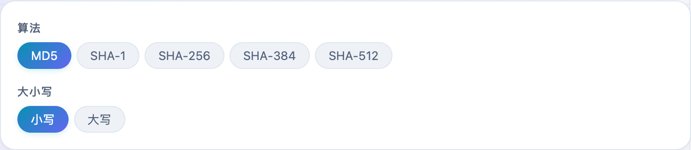
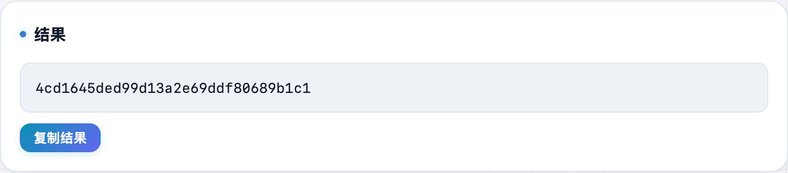

想快速算一段文本的 MD5、SHA-256？或者核对下载文件官网给的校验值？**不学网工具箱** 的 [MD5 / SHA 哈希计算](https://tools.noxue.com/hash/) 输入即出摘要，支持 MD5 和 SHA 全家，大小写随切，全程在本地。

<!--more-->

## 支持

- **五种算法**：MD5、SHA-1、SHA-256、SHA-384、SHA-512。
- **大小写切换**：十六进制结果要大写还是小写，一键切。
- **即时计算**：边输入边出结果。
- **纯本地**：用浏览器自带的 Web Crypto 计算，内容不上传。

## 第一步：选算法，输入内容

选一个算法（默认 MD5），设好大小写，把要算的文本粘进去。

## 第二步：拿摘要

下面实时出十六进制摘要，点「复制结果」即可。


MD5、SHA-1 已经不安全，只适合做完整性校验。存密码要用带盐、慢速的 bcrypt、scrypt 或 Argon2。


配套：需要 Base64 编解码用 [Base64 编解码](https://tools.noxue.com/base64/)。

工具地址：**[https://tools.noxue.com/hash/](https://tools.noxue.com/hash/)**
