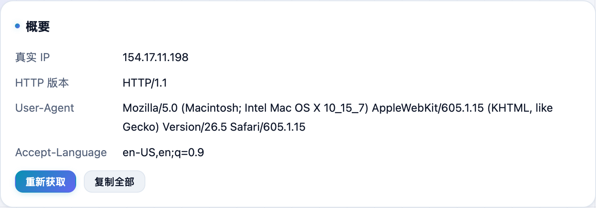
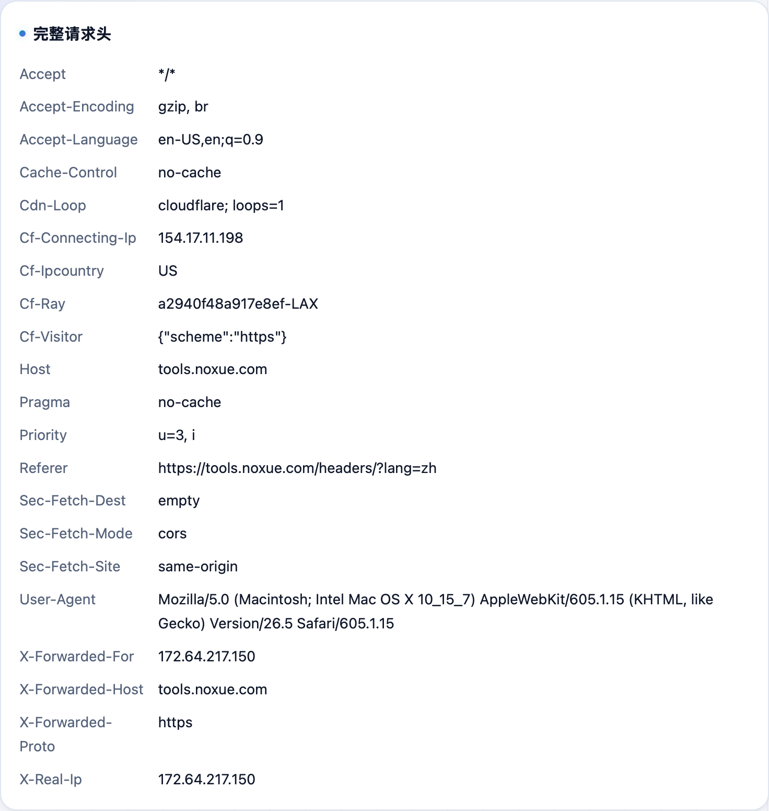

浏览器每次请求都会带一堆头信息，网站就是靠它们认你。**不学网工具箱** 的 [HTTP 请求头查看](https://tools.noxue.com/headers/) 直接显示服务端实际收到的内容——挂了代理但语言、系统对不上，一眼就看出来。

<!--more-->

## 能看到什么

- **真实出口 IP** 和 HTTP 版本。
- **完整请求头**：User-Agent、Accept-Language 等一条条列出。
- **解读**：挑出容易暴露你的项（比如 Accept-Language 还是 zh-CN），给出提醒。
- **一键复制**：全部信息复制走，方便贴给别人排查。

## 第一步：打开就看概要

页面一打开就自动请求一次，上面「概要」给出真实 IP、HTTP 版本等关键信息。

## 第二步：看完整请求头

往下是**完整请求头**，每一项都列出来；再往下有「解读」，点出哪些头可能暴露你。


挂了代理但 Accept-Language 还是 zh-CN、或 User-Agent 暴露真实系统，都可能被网站用来识别你。配合 [网络环境自查](https://tools.noxue.com/netcheck/) 一起看更全。


工具地址：**[https://tools.noxue.com/headers/](https://tools.noxue.com/headers/)**
