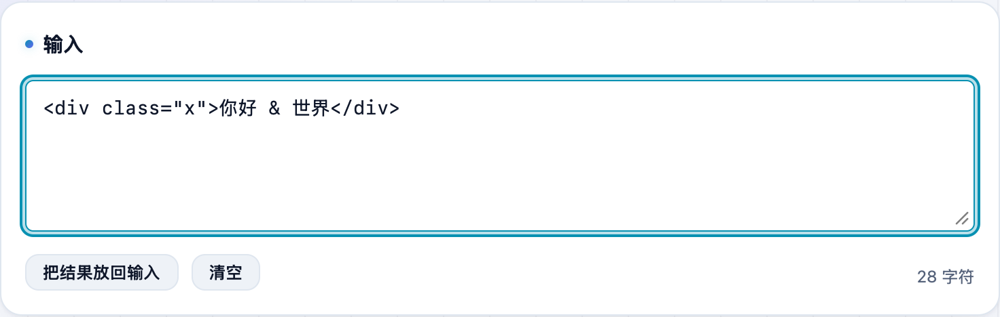
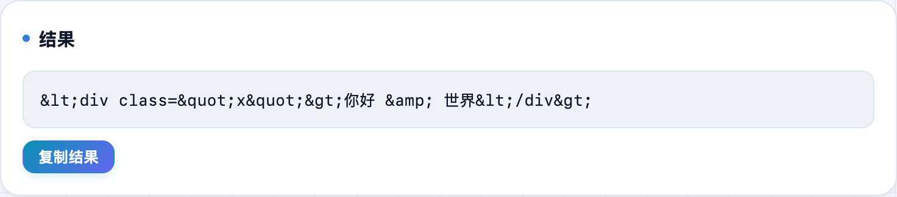

想在网页里原样展示一段带 `<>` 的代码，又不想被浏览器当标签解析、甚至被 `<script>` 注入？**不学网工具箱** 的 [HTML 实体编解码](https://tools.noxue.com/html-entity/) 把特殊字符和 HTML 实体一键互转。

<!--more-->

## 用途

- **编码（转义）**：把 `< > & " '` 转成 `&lt; &gt; &amp;` 等实体，网页里就只当纯文字显示，防 XSS。
- **解码（反转义）**：把接口/数据库里拿到的 `&lt;div&gt;` 还原成可读的 `
`。
- **纯本地**：浏览器里算，内容不上传。

## 第一步：粘内容，选方向

把要处理的文本粘进去，选「编码（转义）」或「解码（反转义）」。

## 第二步：拿结果

下面实时出转义后的实体，点复制即可。下图把 `
你好 & 世界
` 转成了安全显示的实体。


处理 URL 里的特殊字符用 [URL 编解码](https://tools.noxue.com/urlencode/)；处理 `\u` 转义用 [Unicode 转义](https://tools.noxue.com/unicode/)。


工具地址：**[https://tools.noxue.com/html-entity/](https://tools.noxue.com/html-entity/)**
