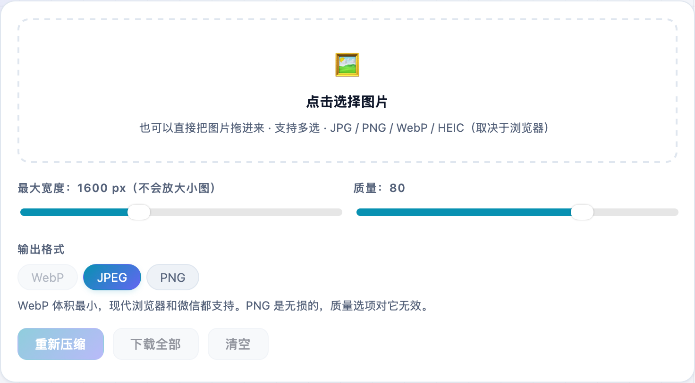
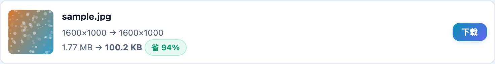

图片太大传不动、又不想传到某个在线压缩网站怕泄露？**不学网工具箱** 的 [图片压缩 / 转 WebP](https://tools.noxue.com/image/) 全程用浏览器本地处理，一张都不上传，还能一次批量压一堆。

<!--more-->

## 为什么好用

- **纯本地**：用浏览器 Canvas 处理，图片不上传任何服务器，关掉页面就没了。
- **批量**：一次拖入多张，挨个压好，「下载全部」一键保存。
- **压缩 + 改尺寸**：设最大宽度和质量，大图自动缩小，小图不会被放大。
- **转格式**：输出 WebP / JPEG / PNG，WebP 同画质下最小。
- **显示省了多少**：每张都标出「原大小 → 压缩后」和节省比例。

## 第一步：拖图进来，调参数

点或拖图片进虚线框，然后调**最大宽度**、**质量**和**输出格式**。博客配图一般 1200~1600 宽、质量 80、WebP 就很合适。


同样画质下 WebP 比 JPEG 小 25%~35%，Safari、Chrome、微信内置浏览器都支持。需要透明背景就选 PNG 或 WebP。


## 第二步：看压缩效果，下载

每张图都列出**原尺寸/大小 → 压缩后**，还有一个「省 XX%」的绿标。下面这张示例从 **1.77 MB 压到 100 KB，省了 94%**，画质基本看不出差别。


如果只是要 PNG↔JPG↔WebP 互转、保留原始尺寸，用姊妹工具 [图片格式转换](https://tools.noxue.com/img-convert/) 更合适。


工具地址：**[https://tools.noxue.com/image/](https://tools.noxue.com/image/)**
