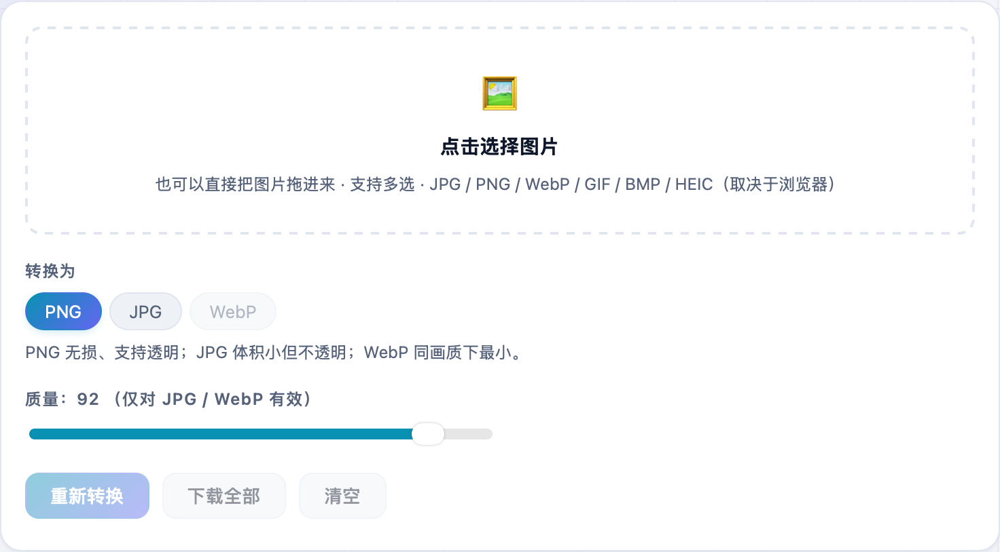
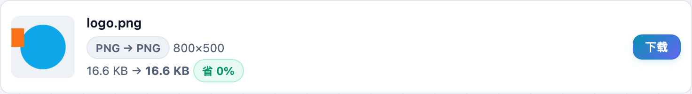

只想把 PNG 转成 JPG、或者把 WebP 转成通用格式，尺寸别动？**不学网工具箱** 的 [图片格式转换](https://tools.noxue.com/img-convert/) 专做格式互转、保留原始尺寸，全程本地、图片不上传。

<!--more-->

## 特点

- **PNG / JPG / WebP 互转**：输入还支持 GIF、BMP、HEIC（取决于浏览器）。
- **保留原始尺寸**：只换格式，不缩放。
- **透明背景处理**：PNG→JPG 时，透明区域会填成你选的背景色（默认白）。
- **批量 + 本地**：一次拖多张，Canvas 本地转换，一张都不上传。

## 第一步：拖图进来，选目标格式

拖入图片，选要转成 **PNG / JPG / WebP**。转 JPG 时可设透明背景填充色，转 JPG/WebP 时可调质量。


要更小体积、不需要透明 → PNG 转 JPG；需要无损或后续抠图 → JPG 转 PNG；网页使用 → 转 WebP；老软件不认 WebP → WebP 转 PNG/JPG。


## 第二步：看结果，下载

每张都标出「原格式 → 目标格式」和尺寸、体积变化，点下载即可，或「下载全部」。


既要转格式又要压体积、改尺寸，用姊妹工具 [图片压缩 / 转 WebP](https://tools.noxue.com/image/)。


工具地址：**[https://tools.noxue.com/img-convert/](https://tools.noxue.com/img-convert/)**
