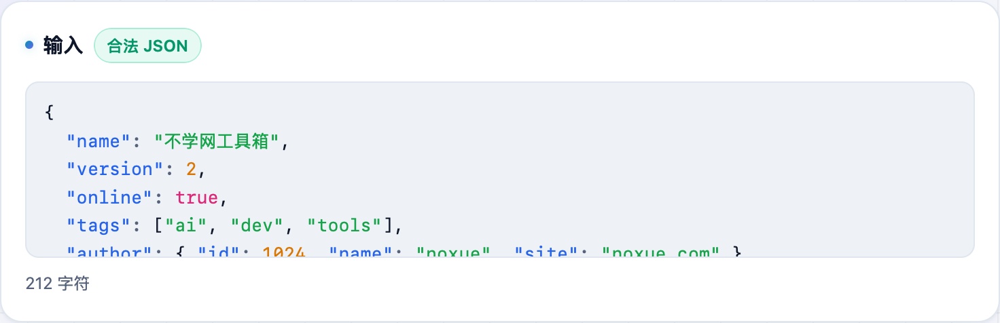
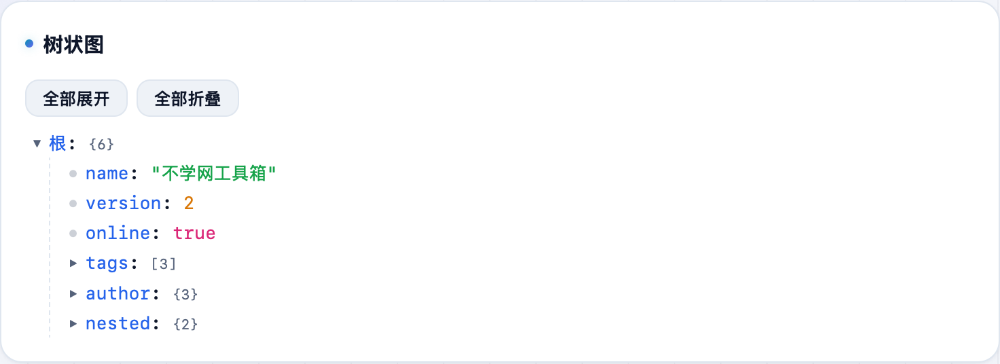

接口返回一坨压扁的 JSON，想格式化看清结构、或者反过来压成一行？**不学网工具箱** 的 [JSON 工具](https://tools.noxue.com/json/) 格式化、压缩、校验都有，还给一个可折叠的树状图，出错还会标出行列位置。

<!--more-->

## 能做什么

- **格式化 / 压缩**：一键美化缩进，或压成一行；缩进大小可选，还能按 key 排序。
- **校验 + 错误定位**：JSON 不合法时，标出**具体第几行第几列**出错。
- **可折叠树状图**：把 JSON 画成带语法高亮的树，长对象点一下折叠/展开。
- **字符串转义 / 还原**：处理那种「JSON 里套了一段字符串 JSON」的场景。
- **本地缓存**：内容存在浏览器本地，刷新不丢，不上传。

## 第一步：粘 JSON

把 JSON 粘进输入框（没有就点「填个示例」）。上面选「格式化 / 压缩」等模式和缩进。


JSON 有语法错误时，工具会标出出错的行列位置，比浏览器控制台那句笼统的报错好定位多了。


## 第二步：看结果和树状图

下面给出格式化/压缩后的结果，还有一个**可折叠树状图**——对象、数组、字符串、数字用不同颜色标出，点三角形折叠长节点。

工具地址：**[https://tools.noxue.com/json/](https://tools.noxue.com/json/)** ，纯前端，数据不上传。
