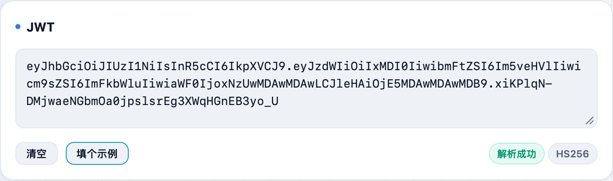
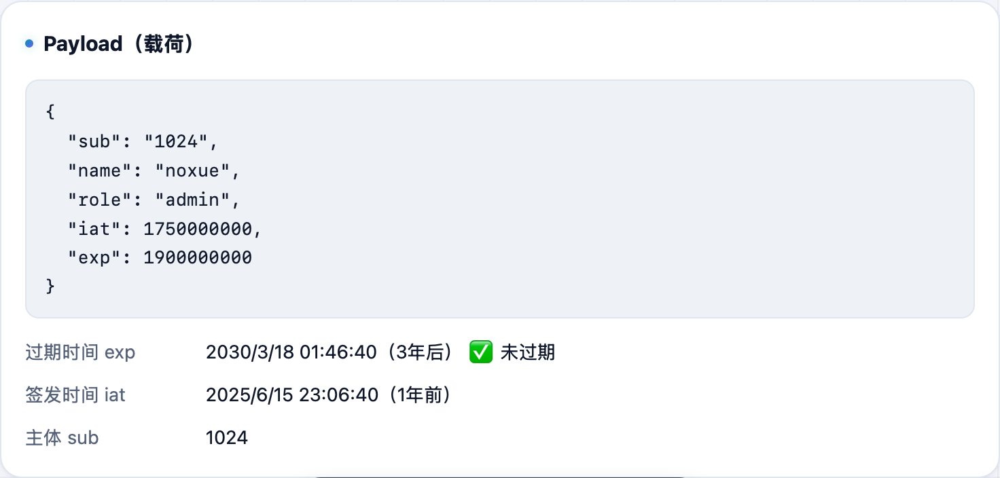

调接口时拿到一串 `xxxxx.yyyyy.zzzzz` 的 JWT，想看看里面装了啥、什么时候过期？**不学网工具箱** 的 [JWT 解码](https://tools.noxue.com/jwt/) 贴上就解，Header、Payload、过期时间一目了然，全程在本地，token 不上传。

<!--more-->

## 能看到什么

- **Header / Payload**：自动 Base64URL 解码成格式化的 JSON。
- **常见字段翻译**：`exp`、`iat`、`nbf` 这些时间字段换算成可读时间，一眼看出**是否过期**。
- **签名校验（可选）**：填入 HMAC 密钥，验证 HS256/384/512 的签名真伪。
- **纯本地**：解码在浏览器里完成，token 不发到任何服务器。

## 第一步：粘 token

把 JWT 粘进输入框（没有的话点「填个示例」先试试）。


Header 和 Payload 只是 Base64，任何人都能解开看内容——所以别往 JWT 里塞密码之类的敏感信息。


## 第二步：看解出来的内容

下面自动列出 **Header** 和 **Payload** 的 JSON，还把 `exp` 等时间字段换算成人能看懂的时间，方便判断有没有过期。


展开「签名校验」，填入 HMAC 密钥即可验证 HS256/384/512 的签名。RS/ES 等非对称算法需要公钥，本工具只支持 HMAC 系列；密钥只在本地参与计算。


配套：想手动解 Base64 看某一段，用 [Base64 编解码](https://tools.noxue.com/base64/)。

工具地址：**[https://tools.noxue.com/jwt/](https://tools.noxue.com/jwt/)**
