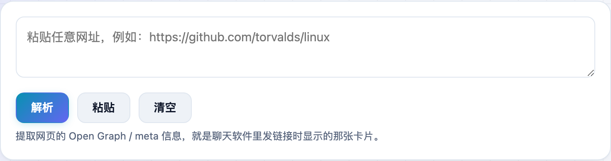
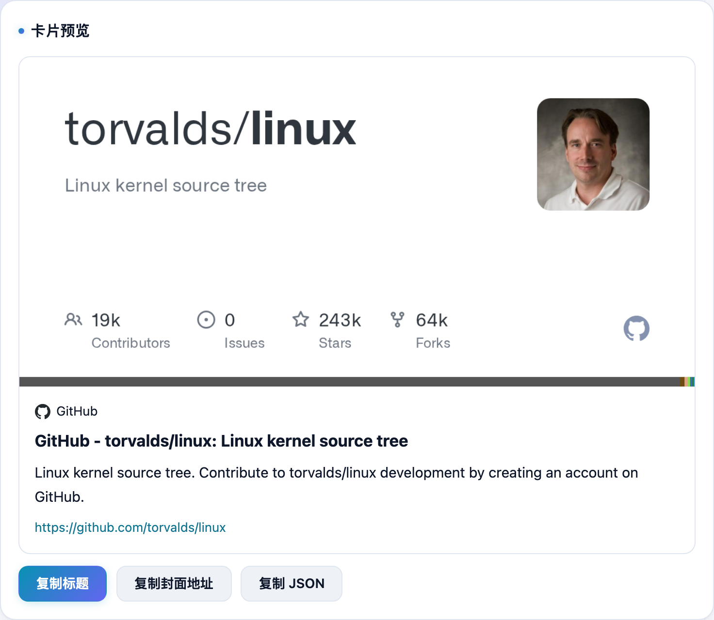

发链接到微信、Telegram 时会自动带出一张卡片——标题、一句话描述、一张大图。**不学网工具箱** 的 [链接预览](https://tools.noxue.com/link-preview/) 就是把任意网址的这张卡片提前解析出来给你看。

<!--more-->

## 特点

- **一眼看全**：标题、描述、封面大图（`og:image`）、站点名、网站图标，一次提取。
- **查自己的站**：发文前先看看自己网页的 Open Graph 配得对不对，分享出去好不好看。
- **复制 JSON**：把提取到的字段一次性复制走，方便二次利用或收藏链接。

## 第一步：粘贴任意网址

把想看的链接粘进去，点「解析」。

## 第二步：看卡片、复制信息

工具会还原出这条链接被分享时的卡片样子——大图、图标、站点名、标题、描述都在。下面可以复制标题、封面地址，或一键复制整段 JSON。


如果卡片图缺失或标题不对，多半是对方网站没配好 Open Graph 标签；用这个工具检查自己的页面，能快速发现问题。需要登录才能看的网站则读不到。


工具地址：**[https://tools.noxue.com/link-preview/](https://tools.noxue.com/link-preview/)**
