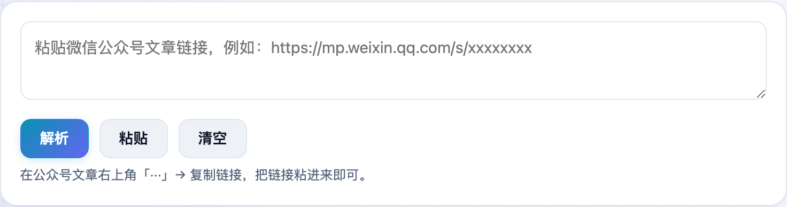
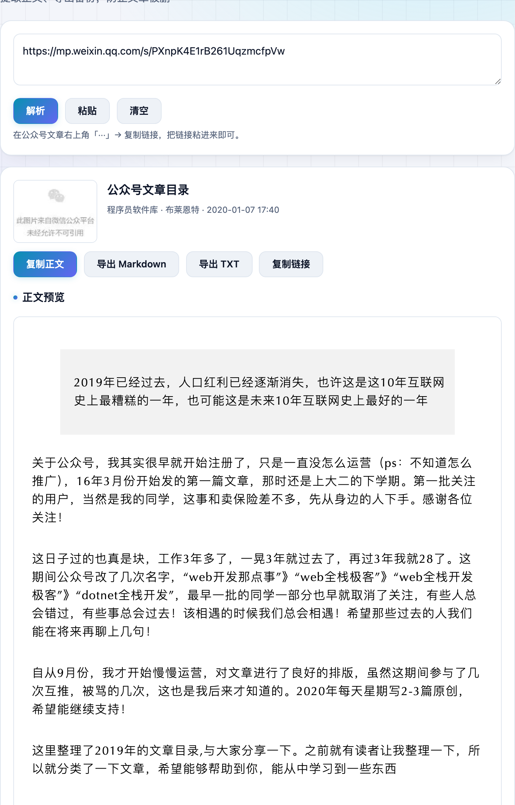

收藏的公众号好文，说没就没——删文、迁移、账号封禁都可能让它消失。**不学网工具箱** 的 [公众号文章解析](https://tools.noxue.com/mp-article/) 把文章链接一粘，正文就抓出来了，还能导出 Markdown / TXT 存本地留个底。

<!--more-->

## 特点

- **信息齐全**：标题、公众号、作者、发布时间、封面、正文一次提取。
- **一键备份**：复制正文，或导出为 **Markdown / TXT** 保存到本地。
- **不用登录**：只读取公开可访问的文章页，不需要任何账号。

## 第一步：粘贴文章链接

在公众号文章右上角「···」→ 复制链接，把链接粘进输入框，点「解析」。

## 第二步：看正文，导出备份

标题、公众号、作者、时间显示在上方，下面是正文预览；点「导出 Markdown / TXT」就能把文章存到本地。


正文里的图片来自微信服务器，有防盗链，预览里偶尔加载不出属正常现象，不影响文字备份。需要「分享给朋友才能看」或已被删除的文章无法解析。



获取一个公众号的「全部历史文章」需要登录会话或付费接口，做不成免费工具；本工具专注于把**单篇文章**稳定地提取和备份下来。提取内容版权归原作者，仅供个人备份学习。


工具地址：**[https://tools.noxue.com/mp-article/](https://tools.noxue.com/mp-article/)**
