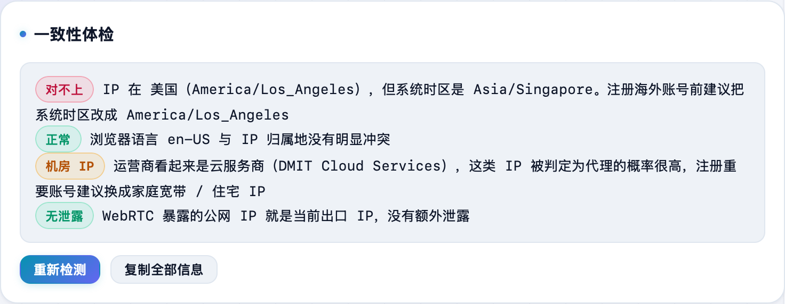
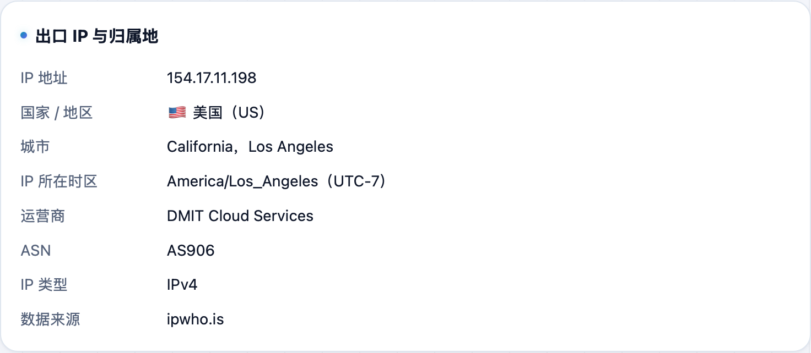

挂了代理注册海外账号，结果 IP 在美国、系统时区还是北京、浏览器语言还是中文——这三样对不上，是最常见的风控触发点。**不学网工具箱** 的 [网络环境自查](https://tools.noxue.com/netcheck/) 一屏帮你对齐。

<!--more-->

## 能查什么

- **一致性体检**：把 IP 国家、系统时区、浏览器语言放一起比，对不上就直接标红提醒。
- **出口 IP 与归属地**：你的真实出口 IP、国家/城市、运营商；还会提示是不是「机房 IP」（容易被判定为代理）。
- **系统与浏览器**：时区、语言、屏幕、UA 等一览。
- **WebRTC 泄露检测**：看有没有绕过代理暴露你的真实公网 IP。

## 第一步：打开就自动体检

页面一打开就自动检测，顶部「一致性体检」直接给出结论：哪项一致、哪项对不上、建议怎么改。


比如提示「IP 在美国，系统时区却是 Asia/Shanghai」，注册前就把系统时区改成对应地区，能少踩很多坑。


## 第二步：看出口 IP 和归属地

往下是**出口 IP 与归属地**：真实 IP、国家/城市、运营商，以及是不是机房网段。

配套：想专门查 DNS 有没有泄漏，用 [DNS 泄漏检测](https://tools.noxue.com/dnsleak/)；看完整请求头用 [HTTP 请求头查看](https://tools.noxue.com/headers/)。

工具地址：**[https://tools.noxue.com/netcheck/](https://tools.noxue.com/netcheck/)**
