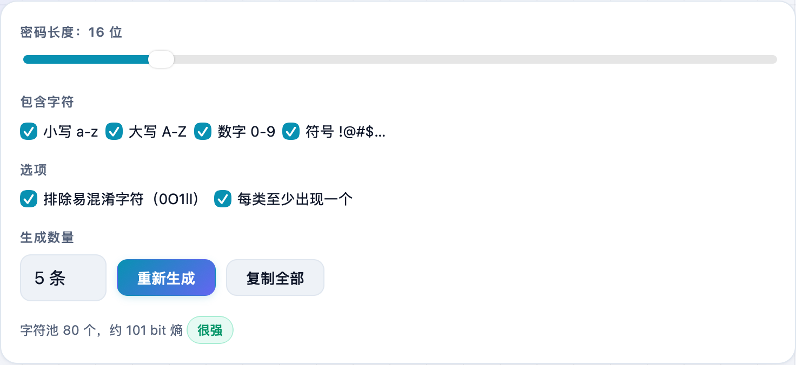
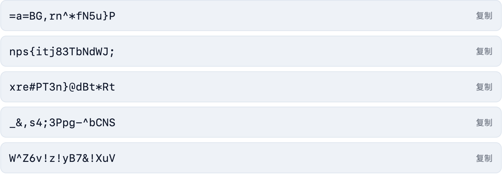

给新账号设密码，用生日、`123456` 这种迟早出事；让浏览器随机生成又怕它哪天同步丢了。我在 **不学网工具箱** 里放了个纯本地的 [密码生成器](https://tools.noxue.com/password/)：参数随便调，一次生成一批，全程在你自己的浏览器里算，不联网、不记录。

<!--more-->

## 为什么用它

- **纯本地生成**：用浏览器自带的加密随机数（`crypto.getRandomValues`），不发到任何服务器。
- **参数可调**：长度 6~64 位，大小写、数字、符号自由勾选。
- **排除易混淆字符**：可以去掉 `0 O 1 l I` 这些一眼看不清的，抄写、口述都省事。
- **每类至少一个**：保证大小写数字符号都出现，满足各网站的强度要求。
- **批量生成**：一次出 1 / 5 / 10 / 20 条，挑一个顺眼的用。

## 第一步：调参数

打开页面，先拉一下**密码长度**，勾选要**包含的字符**（小写 / 大写 / 数字 / 符号），需要的话打开「排除易混淆字符」和「每类至少出现一个」，再选**生成数量**。


一般账号 16 位以上、四类字符都带就很稳了；重要账号（邮箱、银行）可以拉到 20 位以上。


## 第二步：点一条就复制

生成结果一条条列出来，**点任意一条即可复制**。不满意就点「重新生成」再来一批，或者「复制全部」一次拿走。


这个工具只负责「生成」，不帮你保存。生成后请存进你自己的密码管理器（如系统钥匙串、Bitwarden、1Password 等），别截图发聊天工具。


## 顺手一提

不学网工具箱里还有个 [2FA 两步验证码](https://tools.noxue.com/totp/) 工具，配合强密码一起用，账号安全再上一层。

工具地址：**[https://tools.noxue.com/password/](https://tools.noxue.com/password/)** ，打开即用，无需登录。
