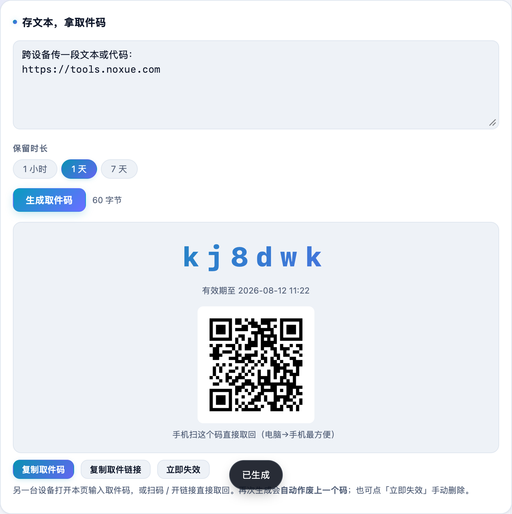

想把电脑上一段文本、一串命令快速传到手机，又懒得发微信、开邮件？**不学网工具箱** 的 [在线剪贴板](https://tools.noxue.com/paste/) 一台存、一台取：存下拿个 6 位取件码，另一台输码或扫码就取回。

<!--more-->

## 特点

- **取件码 + 二维码**：存完给一个 6 位码和二维码，电脑存、手机扫码直接取，最方便。
- **定时失效**：可设 1 小时 / 1 天 / 7 天自动过期。
- **一码对一份**：重新生成会自动作废上一个码；也能点「立即失效」手动删除。
- **随手粘**：带取件码链接直接打开就取回；页面里任意位置 Ctrl / ⌘ + V 直接粘进输入框。

## 第一步：粘文本，生成取件码

把要传的文本 / 代码粘进「存文本」框，选保留时长，点「生成取件码」。

## 第二步：另一台输码 / 扫码取回

生成后给出**取件码 + 二维码**：手机扫码直接取回，或在另一台设备打开本页输入这个码。


内容存在服务器上（到期自动删），服务端能看到明文。适合传普通文本、代码、链接，不适合放密码等敏感信息。


工具地址：**[https://tools.noxue.com/paste/](https://tools.noxue.com/paste/)**
