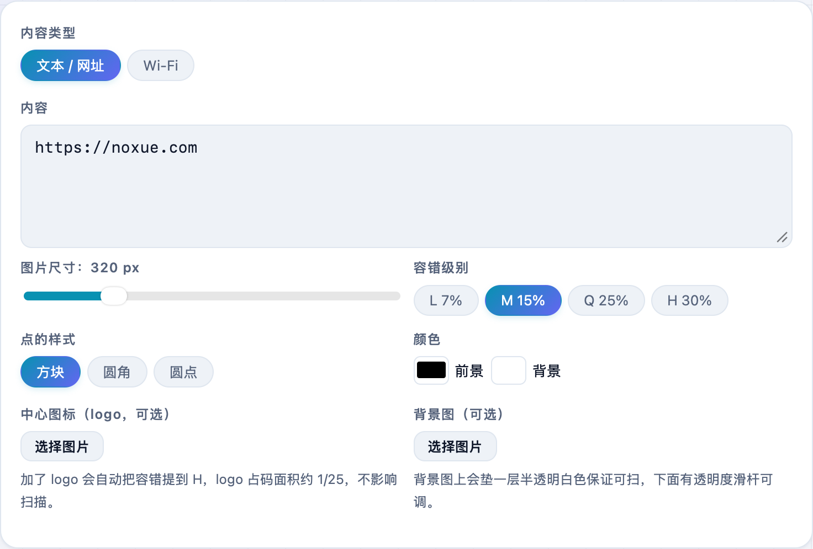

想把一段网址、一串文本、或者家里的 Wi-Fi 变成二维码贴出来？不用装 App，也不用担心被塞广告。**不学网工具箱** 的 [二维码生成器](https://tools.noxue.com/qrcode/) 全程在浏览器本地生成，还能改颜色、加 Logo、下载高清 PNG / SVG。

<!--more-->

## 亮点

- **三种内容**：文本 / 网址、Wi-Fi（扫码直接连网）。
- **可定制**：尺寸、容错级别、点的样式（方块 / 圆角 / 圆点）、前景 / 背景色。
- **加中心 Logo、加背景图**：做出带品牌的二维码，自动提高容错保证能扫。
- **自检**：生成后本机会尝试扫一次，「自检通过」才放心用。
- **下载 PNG / SVG**：SVG 无限放大不糊，印刷、海报都能用。

## 第一步：选内容、调样式

选「内容类型」，把文本 / 网址填进去（或切到 Wi-Fi 填名称和密码）。下面可以调尺寸、容错、点样式和颜色，想要品牌感就加个中心 Logo。


切到 Wi-Fi，填好名称（SSID）和密码，生成的码用手机相机一扫就能直接连网，很适合贴在路由器上或分享给客人。


## 第二步：确认自检，下载使用

右侧实时出码，下面标着版本、尺寸和「自检通过 · 本机已成功扫出这张码」。确认没问题就 **下载 PNG 或 SVG**，手机上长按图片也能直接存相册。


背景图会盖一层半透明白色保证可扫，如果太花，调高「白色蒙层」透明度，或把容错级别提到 H。


## 配套工具

反过来想**识别**一张二维码里的内容？用 [二维码解析](https://tools.noxue.com/qrdecode/)，粘贴截图就能读出来，图片不上传。

工具地址：**[https://tools.noxue.com/qrcode/](https://tools.noxue.com/qrcode/)** ，打开即用。
