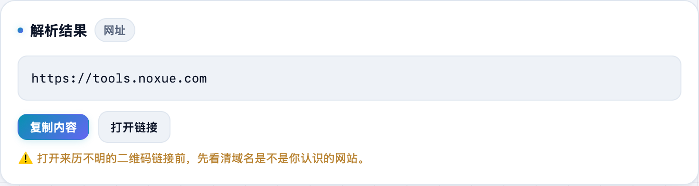

电脑上看到一个二维码，手机扫不方便？截个图丢进来就能读出里面是啥。**不学网工具箱** 的 [二维码解析](https://tools.noxue.com/qrdecode/) 全程在浏览器本地识别，图片不上传。

<!--more-->

## 特点

- **三种方式**：直接 Ctrl / ⌘ + V 粘贴截图、拖拽图片、或点击选图。
- **本地识别**：在浏览器里解码，图片不上传任何服务器。
- **认得多种内容**：网址、纯文本、Wi-Fi 连接码都能识别。
- **带安全提示**：识别到网址会提醒你先看清域名再打开。

## 第一步：把二维码图片丢进来

截图后直接在页面上按粘贴快捷键，或把图片拖进虚线框，手机上点一下从相册选。

## 第二步：读出内容

识别成功后，下面直接显示**解析结果**（还标了类型，比如「网址」），可以复制内容或打开链接。


打开来历不明的二维码链接前，先看清域名是不是你认识的网站，别被钓鱼。


配套：反过来**生成**二维码用 [二维码生成](https://tools.noxue.com/qrcode/)。

工具地址：**[https://tools.noxue.com/qrdecode/](https://tools.noxue.com/qrdecode/)**
