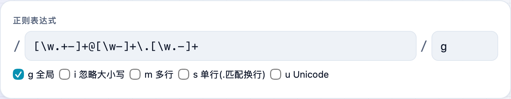
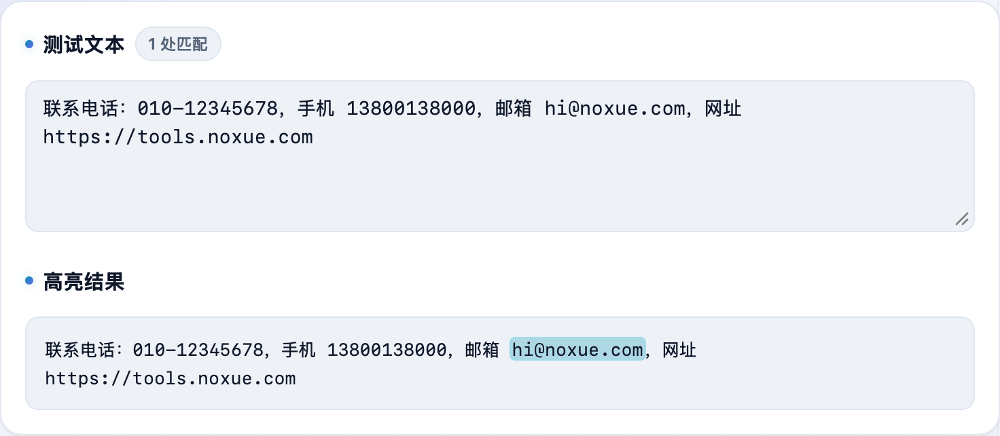

写正则总是一遍遍改、一遍遍试？**不学网工具箱** 的 [正则表达式测试](https://tools.noxue.com/regex/) 边改边高亮匹配，分组、替换预览都有，还顺手把 JavaScript、Python、Go 等各语言的用法代码给你生成好。

<!--more-->

## 特点

- **实时高亮**：改表达式或标志位（g/i/m/s/u），匹配结果立刻在文本里高亮。
- **匹配详情**：每个匹配、每个捕获组分别列出来，位置一清二楚。
- **替换预览**：填替换式（支持 `$1 $2` 引用分组），实时看替换后的效果。
- **各语言用法**：按当前表达式生成 JavaScript / Python / Java / Go / PHP / C# / Rust / grep 的调用代码，复制就能用。
- **常用正则**：手机号、邮箱、URL 等常用模式点一下即套用。

## 第一步：写表达式，选标志位

在斜杠之间写正则，右边填标志位，或勾选 `g 全局`、`i 忽略大小写` 等。下面粘上要匹配的文本。


本测试器用 JavaScript(ECMAScript) 引擎。语法大体相同，但 Go / Rust（RE2）不支持后行断言 `(?<=)`；命名组写法也略有不同——工具生成各语言代码时会帮你对齐。


## 第二步：看高亮、看分组、看替换

文本里命中的部分会**实时高亮**，「匹配详情」里逐条列出每个匹配和捕获组，还能在「替换预览」里试替换效果。

配套：处理文本里的转义时，可以配合 [Unicode 转义](https://tools.noxue.com/unicode/) 或 [URL 编解码](https://tools.noxue.com/urlencode/)。

工具地址：**[https://tools.noxue.com/regex/](https://tools.noxue.com/regex/)**
