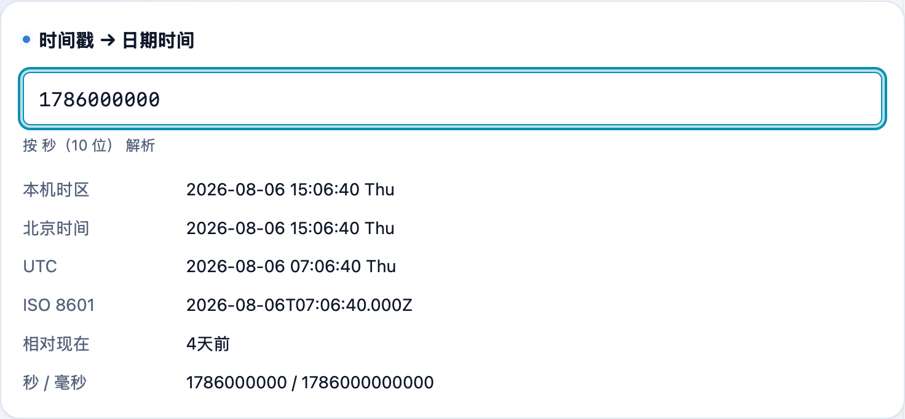

写代码、看日志时经常要在「一串数字」和「人能看懂的时间」之间来回换。**不学网工具箱** 的 [时间戳转换](https://tools.noxue.com/timestamp/) 一屏搞定：实时当前时间戳、双向转换、自动识别秒/毫秒/微秒，还附了个世界时钟。

<!--more-->

## 能干嘛

- **实时当前时间戳**：秒级、毫秒级同时显示，点一下就复制，可暂停。
- **时间戳 → 日期**：粘一串数字，自动认出是秒、毫秒还是微秒，转成可读时间。
- **日期 → 时间戳**：选个日期时间，反过来算出时间戳。
- **世界时钟**：常用时区的当前时间一览，注册海外账号、跨时区协作时方便。

## 第一步：看当前时间戳、点复制

打开就能看到当前的**秒级和毫秒级时间戳**，点数字即可复制。需要定住看就点「暂停刷新」。

## 第二步：粘时间戳，自动转成日期

把一串时间戳粘进「时间戳 → 日期时间」，工具会**自动判断单位**（秒/毫秒/微秒），列出对应的本地时间、UTC 时间等。反方向选日期也能算回时间戳。


10 位一般是秒、13 位是毫秒、16 位是微秒。工具会自动判断，不用你数位数。


工具地址：**[https://tools.noxue.com/timestamp/](https://tools.noxue.com/timestamp/)** ，纯前端，打开即用。
