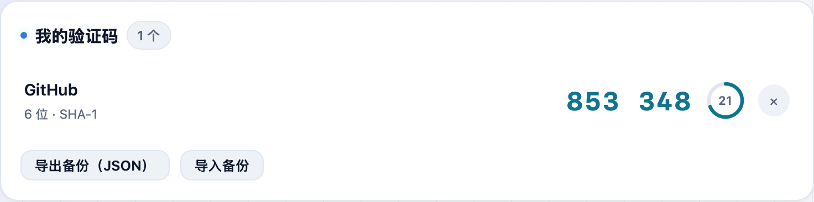

Google Authenticator 换手机就抓瞎、验证码不能在电脑上看？**不学网工具箱** 的 [2FA 两步验证码](https://tools.noxue.com/totp/) 是个网页版验证器：密钥只存在你自己的浏览器里，电脑上随时看验证码，还能导出备份、端到端加密同步到多台设备。

<!--more-->

## 特点

- **本地保存**：密钥存在浏览器（localStorage + IndexedDB 双备份），不发到服务器。
- **实时验证码**：6/8 位、SHA-1/256/512 都支持，剩 5 秒会变红闪烁提醒。
- **点一下就复制**：点验证码即复制，不用手抄。
- **导出 / 导入备份**：换设备前导出 JSON，随时迁移。
- **端到端加密云同步**：用一组助记词把账号在本地加密后再上传，服务器只存密文、看不到你的密钥；另一台设备输入同一助记词即可恢复。

## 第一步：添加账号

在「添加新账号」里填个备注名（比如 GitHub、币安），把网站给的 **Base32 密钥** 粘进去——或者直接粘 `otpauth://` 链接，名称和参数会自动识别。


就是网站开启两步验证时，二维码旁边那串「手动输入密钥 / setup key」。


## 第二步：随时看验证码，点一下复制

保存后，账号出现在「我的验证码」列表里，每 30 秒刷新一次，**点验证码即可复制**。左边的环形进度和倒计时告诉你还剩几秒，快过期时会变红闪烁。


开了加密云同步后，那 12 个助记词是解开云端数据的唯一钥匙。请离线抄好，忘了就永久打不开，谁也帮不了你找回。


## 搭配使用

先用 [密码生成器](https://tools.noxue.com/password/) 生成强密码，再用这个管好 2FA，账号安全就比较到位了。

工具地址：**[https://tools.noxue.com/totp/](https://tools.noxue.com/totp/)**
