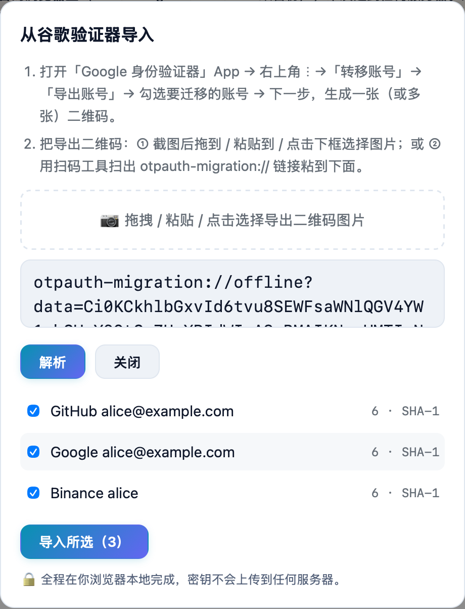
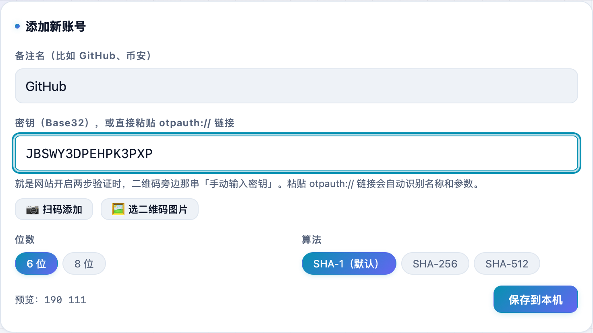
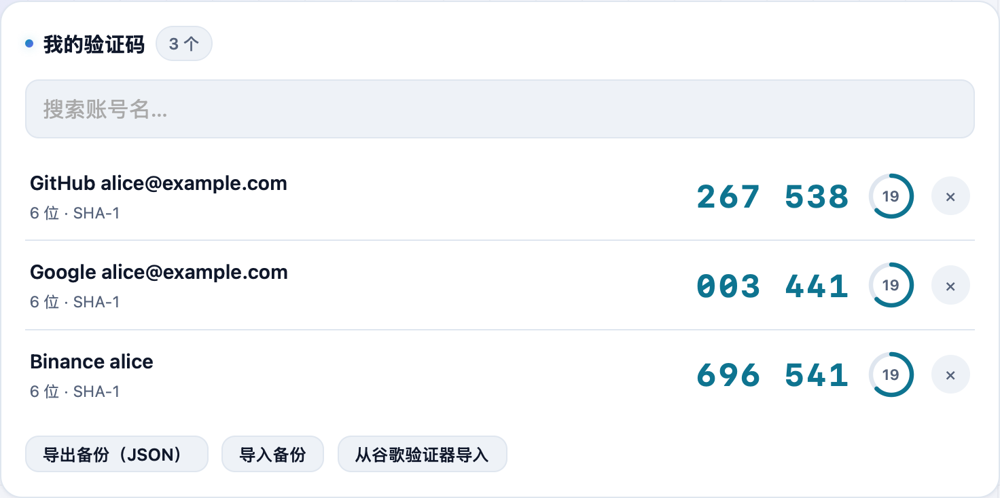

换手机迁移谷歌验证器很麻烦、验证码又不能在电脑上看？**不学网工具箱** 的 [2FA 两步验证码](https://tools.noxue.com/totp/) 是个网页版验证器：能**一键导入 Google Authenticator（谷歌验证器）的全部账号**，也能扫码 / 截图 / 手动添加；密钥只存在你自己的浏览器里，不发到服务器。

<!--more-->

## 亮点

- **谷歌验证器一键导入**：解析官方「导出账号」二维码，一次性把所有账号搬进来。
- **多种添加方式**：摄像头扫码、选二维码图片（截图最稳）、粘贴 `otpauth://` 链接、手动输入密钥。
- **密钥只在本地**：localStorage + IndexedDB 双备份，绝不上传。
- **常用自动置顶**：按复制次数排序，天天用的账号排最前，不用每次搜索。
- **实时验证码**：6/8 位、SHA-1/256/512 都支持，点一下即复制，快过期变红闪烁。
- **导出备份 + 端到端加密云同步**：换设备无缝迁移。

## 一、从谷歌验证器一键导入（推荐）

在手机上打开「Google 身份验证器」→ 右上角 ⋮ →「转移账号」→「导出账号」→ 勾选要迁移的账号 → 生成一张导出二维码。然后在本工具点「**从谷歌验证器导入**」，把这张二维码**截图**后选图（或用扫码工具扫出 `otpauth-migration://` 链接粘进来），工具会解析出全部账号，勾选后一键导入：


导出二维码很密集，**直接拍电脑 / 手机屏幕的照片容易糊、识别不出**。最稳的是把二维码**截图**保存成图片再选图导入；安卓 Chrome 支持系统级识别，成功率更高。全程在你浏览器本地完成，密钥不会上传。


## 二、扫码 / 截图 / 手动，添加单个账号

只加一个账号时，点「📷 扫码添加」用摄像头扫，或「🖼 选二维码图片」选一张截图；也能直接粘 `otpauth://` 链接或手动输入 Base32 密钥，名称和参数会自动识别。


就是网站开启两步验证时，二维码旁边那串「手动输入密钥 / setup key」。


## 三、实时验证码，常用的自动排最前

账号都在「我的验证码」列表里，每 30 秒刷新，**点验证码即可复制**。列表**按复制次数排序**——你天天用的账号会自动置顶，不用每次在一堆账号里翻找。左侧环形进度和倒计时告诉你还剩几秒，快过期时变红闪烁。


所有密钥只存在本机浏览器，也可导出 JSON 备份随时迁移。若开启加密云同步，那 12 个助记词是解开云端数据的唯一钥匙，请离线抄好，忘了就永久打不开，谁也帮不了你找回。


## 搭配使用

先用 [密码生成器](https://tools.noxue.com/password/) 生成强密码，再用这个管好 2FA；换机时直接用上面的「一键导入」把谷歌验证器整体搬过来即可。

工具地址：**[https://tools.noxue.com/totp/](https://tools.noxue.com/totp/)**
