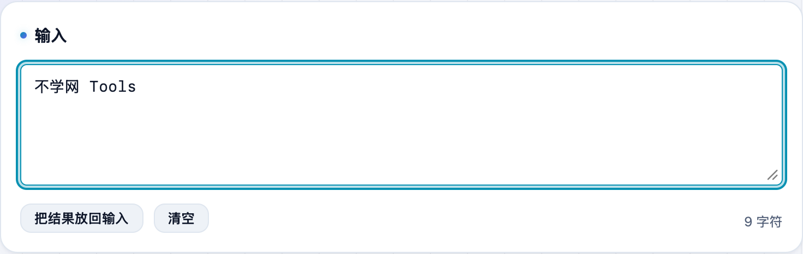
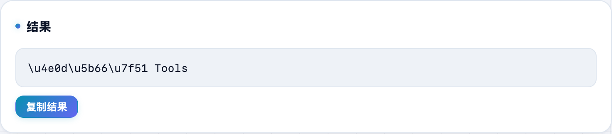

接口返回或日志里出现一串 `不学网` 看不懂？其实解码回来就是中文。**不学网工具箱** 的 [Unicode 转义](https://tools.noxue.com/unicode/) 让中文和 `\u` 转义序列一键互转。

<!--more-->

## 用途

- **中文 → \\u 转义**：把中文写进只认 ASCII 的配置、源码字符串时更保险。
- **\\u 转义 → 中文**：把 `\u` 开头的一串还原成可读文字，排查「中文变转义」类乱码。
- **兼容 \\x**：解码同时识别 `\uXXXX` 和 `\xXX`；BMP 以外的 Emoji 由代理对表示，也能还原。
- **纯本地**：浏览器里算，内容不上传。

## 第一步：粘内容，选方向

把中文或 `\u` 转义串粘进去，选转换方向。

## 第二步：拿结果

下面实时出结果，点复制即可。


`\u` 后跟 4 位十六进制码点，是 JavaScript、JSON、Java 等语言表示字符的写法。有些系统会把中文自动存成这种转义形式。


工具地址：**[https://tools.noxue.com/unicode/](https://tools.noxue.com/unicode/)**
