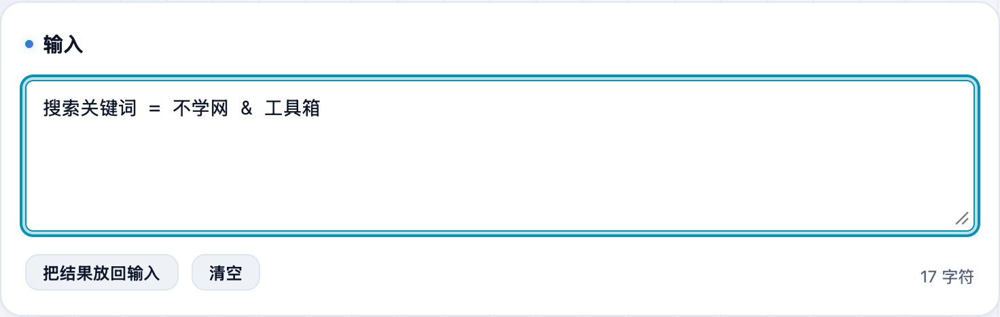
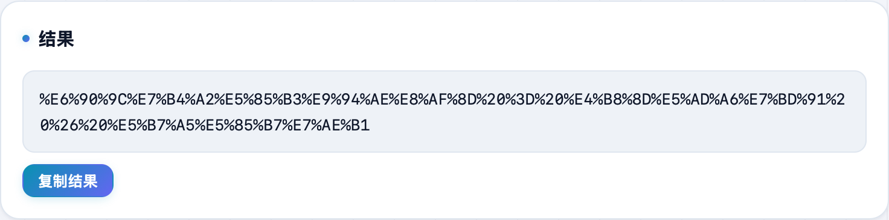

拼查询参数时，值里带中文、空格、`&` 就得先 URL 编码，不然链接会截断或串参数；看日志里一串 `%E4%B8%AD%E6%96%87` 又想解回来。**不学网工具箱** 的 [URL 编解码](https://tools.noxue.com/urlencode/) 两个方向都能一键搞定。

<!--more-->

## 能做什么

- **两种范围**：
  - **组件（encodeURIComponent）**——编码参数值、路径片段，会把 `& = ? / #` 也转义，最常用；
  - **完整 URI（encodeURI）**——对整条网址编码，保留 `: / ? # & =` 这些结构字符。
- **双向**：编码、解码一键切换。
- **纯本地**：浏览器里算，内容不上传。

## 第一步：粘内容，选范围和方向

把要处理的文字粘进去，选「组件」还是「完整 URI」，再选编码 / 解码。


给某个查询参数的值编码，用「组件（encodeURIComponent）」；只有对一整条网址编码时才用「完整 URI」。


## 第二步：拿结果

下面实时出转义后的结果，点「复制结果」即可。反过来把 `%XX` 解回可读文字也是一样。

配套：处理 HTML 里的特殊字符用 [HTML 实体](https://tools.noxue.com/html-entity/)；处理 `\u` 转义用 [Unicode 转义](https://tools.noxue.com/unicode/)。

工具地址：**[https://tools.noxue.com/urlencode/](https://tools.noxue.com/urlencode/)**
