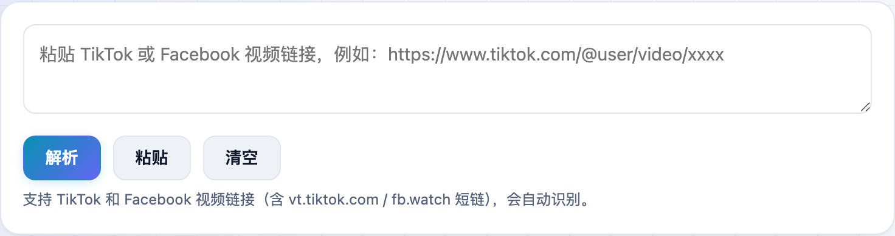
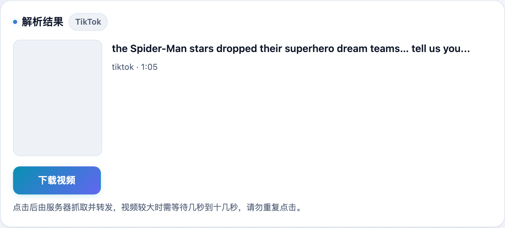

想把 TikTok、Facebook 上的视频存下来，网上一堆下载站不是塞广告就是要你装东西。**不学网工具箱** 的 [TikTok / Facebook 视频下载](https://tools.noxue.com/video-dl/) 把链接一粘，无水印视频就能直接存到本地。

<!--more-->

## 特点

- **无水印**：下载的是原视频，不带平台水印。
- **两个平台**：TikTok 和 Facebook（含 `vt.tiktok.com` / `fb.watch` 短链），自动识别链接。
- **不用装东西**：纯网页操作，不用装 App、不用登录。

## 第一步：粘贴视频链接

把 TikTok 或 Facebook 的视频链接粘进去，点「解析」。

## 第二步：确认信息，点下载

解析出标题、作者、时长和封面后，点「下载视频」，稍等片刻浏览器就会把 MP4 存下来。


TikTok / Facebook 的视频直链锁定了访问 IP，浏览器直连会被拒。所以是由我们的服务器代抓下来再转发给你——这一步需要几秒到十几秒，点了「下载」耐心等一下、别重复点就好。



Instagram 必须登录 cookie 才能访问，做不成公开工具；YouTube 视频流是加密的，只能提供信息与封面（见 [YouTube 解析](https://tools.noxue.com/youtube/)）。抖音 / 快手 / B站 请用各自的专属工具。视频版权归原作者，请勿用于侵权用途。


工具地址：**[https://tools.noxue.com/video-dl/](https://tools.noxue.com/video-dl/)**
