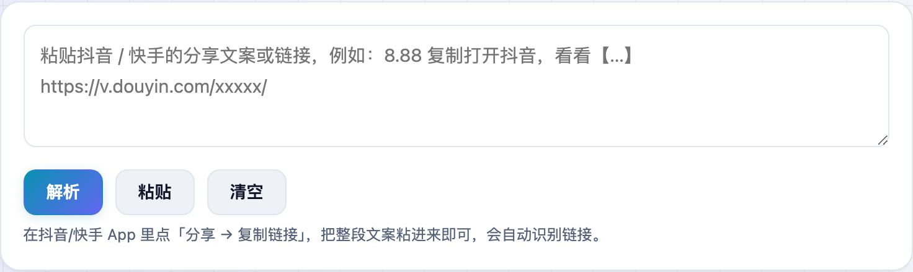

刷到喜欢的抖音、快手视频想存下来，结果保存的都带一圈水印。**不学网工具箱** 的 [短视频解析](https://tools.noxue.com/video-parser/) 把分享链接一粘，无水印原视频就能在线看、直接下。

<!--more-->

## 特点

- **无水印**：解析出的是原视频，不带平台水印和 ID。
- **抖音 + 快手**：短链（`v.douyin.com` / `v.kuaishou.com`）和网页链接都支持。
- **粘整段文案就行**：直接把 App 里「分享 → 复制链接」的一大段文字粘进来，工具会自动识别出链接。
- **图集也支持**：遇到多图作品，会把每张原图列出来给你保存。

## 第一步：粘贴分享文案

在抖音/快手里点「分享 → 复制链接」，把整段文案粘进输入框，点「解析」。

## 第二步：预览并下载

稍等一两秒，视频就出现在页面里可以直接播放，下面有「下载视频」「复制直链」按钮。


点「下载视频」如果直接播放了，手机长按、电脑右键「视频另存为」即可保存到本地。解析只读取平台的公开分享页，不需要登录、不保存你的信息。



视频号的视频地址和微信客户端加密绑定，没有干净的网页解析方式，所以本工具只支持抖音和快手。视频版权归原作者，请勿用于侵权用途。


工具地址：**[https://tools.noxue.com/video-parser/](https://tools.noxue.com/video-parser/)**
