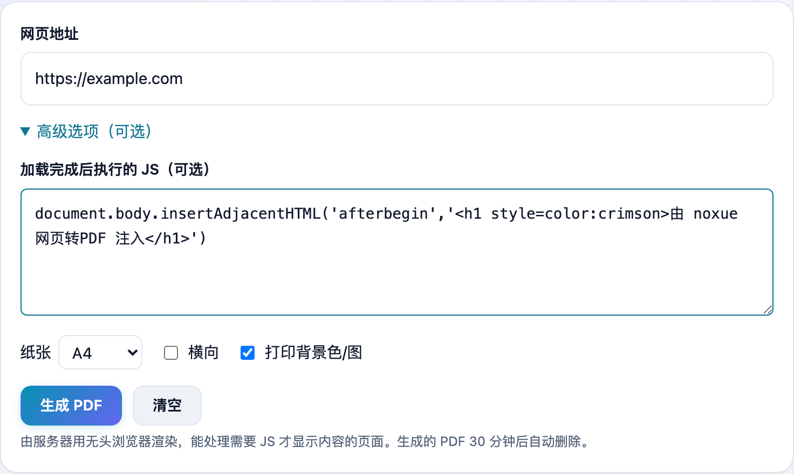

想把一个网页存成 PDF，浏览器自带的「打印」经常连广告、悬浮条一起印进去，还有些内容要滚动或点一下才加载出来。**不学网工具箱** 的 [网页转 PDF](https://tools.noxue.com/webpage-pdf/) 用服务器上的无头浏览器渲染，还能在**页面加载完成后先跑一段你的 JS**，把页面收拾干净再导出。

<!--more-->

## 特点

- **真浏览器渲染**：服务器用无头 Chromium 打开，需要 JS 才显示内容的现代网页也能正常转。
- **加载后执行 JS**（亮点）：可在生成前跑一段你的 JS —— 去广告、展开「阅读全文」、滚动到底加载懒图、隐藏登录弹窗，随你处理。
- **预览 + 下载**：生成后直接在线预览，满意再下载或新标签打开。
- **用完即删**：PDF 只临时存在服务器，**30 分钟后自动删除**，不留底。

## 第一步：填网址（可选加 JS）

粘贴网址；需要的话展开「高级选项」，在 JS 框里写一段加载后要执行的代码，再选纸张/方向。

## 第二步：预览并下载

点「生成 PDF」，服务器渲染完就能在页面里预览，下面可以下载或新标签打开。下图就是转出来的 PDF 效果（中文排版正常）。


- 去广告/弹窗：`document.querySelectorAll('.ad, .popup, .cookie').forEach(e => e.remove())`
- 展开全文：`document.querySelector('.read-more')?.click()`
- 滚动加载懒图：`window.scrollTo(0, document.body.scrollHeight)`

这段 JS 只在目标网页里执行，和你在浏览器控制台里跑一样。



出于安全，**不能转换内网 / 本机地址**（127.0.0.1、192.168.* 等一律拒绝）。渲染较耗资源，做了频率限制；页面打不开或加载超时会失败，换个页面或稍后再试。


工具地址：**[https://tools.noxue.com/webpage-pdf/](https://tools.noxue.com/webpage-pdf/)**
