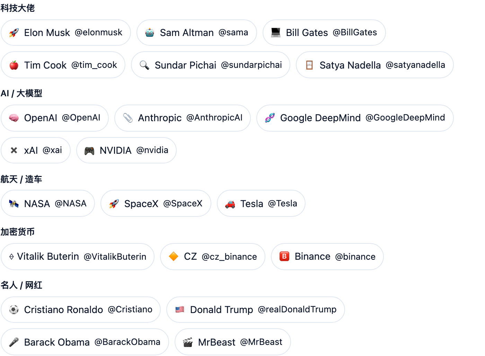

想看看马斯克、OpenAI、NASA 在推特上发了啥，又不想注册登录、还得对着英文发愁。**不学网工具箱** 的 [推特推文查看](https://tools.noxue.com/x-tweets/) 输入用户名（或直接点名人卡片）就能看他们最近的推文，还能一键翻译成中文对照原文。

<!--more-->

## 特点

- **名人快选**：科技大佬、AI 大模型、航天造车、加密货币、名人网红分好类，点一下就加载。
- **原文 + 译文**：勾选「显示中文翻译」，每条推文原文下方给出中文对照，看懂不费劲。
- **内容齐全**：文字、图片、视频、点赞/转发/评论数都在，点时间还能跳到原推。
- **免登录**：走 X 的公开嵌入接口，不用登录、不用翻墙账号。

## 第一步：点名人，或输入用户名

页面上列好了一批常见名人，点一下即可；也可以在输入框里填任意公开账号的用户名。

## 第二步：看推文 + 中文翻译

推文流出来后，勾选「显示中文翻译」，每条原文下面就会带上中文，图片视频也一并展示。


只能看**公开账号**；上锁（受保护）的账号看不到。X 偶尔会限流，加载失败过一会儿再试就好。翻译用的是谷歌翻译，仅供参考。


工具地址：**[https://tools.noxue.com/x-tweets/](https://tools.noxue.com/x-tweets/)**
