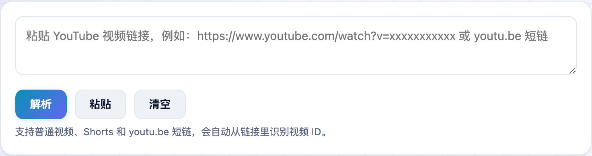
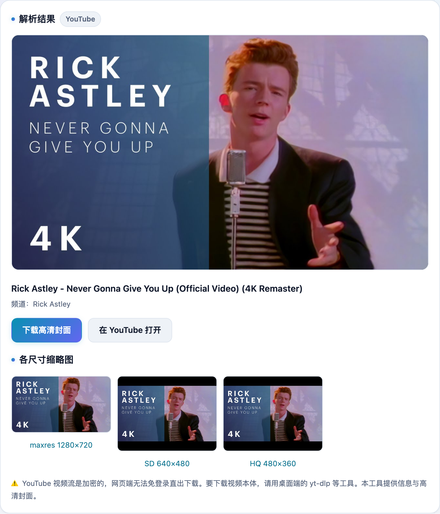

做视频封面参考、写文章配图，经常要扒一张 YouTube 视频的高清缩略图。**不学网工具箱** 的 [YouTube 解析](https://tools.noxue.com/youtube/) 把链接一粘，标题、频道和各尺寸封面就都出来了，点图即存。

<!--more-->

## 特点

- **高清封面**：直接给出 `maxresdefault` 高清缩略图，还有 SD / HQ 各尺寸备选。
- **视频信息**：标题、频道名一并提取。
- **链接全兼容**：普通视频、`Shorts`、`youtu.be` 短链都能自动识别视频 ID。

## 第一步：粘贴 YouTube 链接

把视频链接粘进去点「解析」，普通链接、Shorts、短链都行。

## 第二步：下载封面、拿信息

标题、频道显示在上面，大图就是高清封面，下面还列出了各个尺寸的缩略图，点任意一张即可下载。


YouTube 的视频流地址经过签名加密，需要不断更新的解密器（如 yt-dlp）才能取到，网页端免登录做不到。所以本工具专注于**信息与高清封面**；要下载视频本体，请用桌面端的 [yt-dlp](https://github.com/yt-dlp/yt-dlp)。


工具地址：**[https://tools.noxue.com/youtube/](https://tools.noxue.com/youtube/)**
